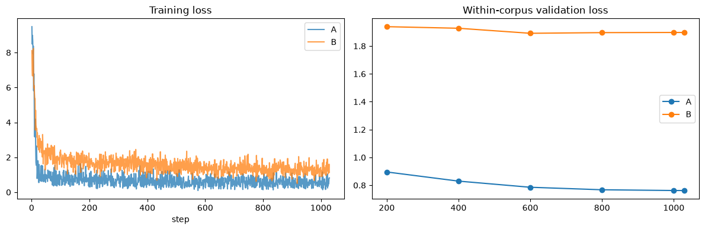

# Lab 15 - Test the data hypothesis with LoRA

**Goal:** test whether Dataset B improves post-opening Wordle policy when the model, LoRA setup, optimizer, schedule, and evaluation stay fixed.

Lab 13 found the data problem. Lab 14 built an intervention. This lab trains the models and accepts whatever result appears.

The causal question is:

> Does a dataset designed around deployed policy behavior outperform the original curriculum?

## 15.1 Pre-registered experiment

Dataset A is the unchanged Lab 06 corpus. Dataset B is the frozen Lab 14 corpus.

Both runs use:

- `Qwen/Qwen3-0.6B` from a fresh load;
- LoRA rank 8, alpha 16, dropout 0.05;
- `q_proj`, `k_proj`, `v_proj`, and `o_proj` targets;
- AdamW at `1e-4` with cosine decay and 5% warmup;
- batch size 16 and seed 42;
- 1,029 full-batch optimizer steps, equal to one Dataset A pass minus its final singleton row;
- the final-step adapter, with validation loss used only as a diagnostic.

Equal epochs would give Dataset A about twice the token exposure. Fixed steps substantially control optimization exposure. The notebook reports actual non-padding tokens after training.

## 15.2 Metric hierarchy

The primary metric is **fixed-state usable-policy rate** on the 47 held-out post-opening states. A successful response must be a format-valid five-letter answer-list word, avoid every guess in the supplied history, and satisfy all prior feedback. Both models receive the same states, so the denominator and difficulty mix cannot change with model behavior.

Each fixed state is evaluated twice. The training-format prompt isolates the data hypothesis and carries the primary result. The deployment-format prompt measures transfer across the known prompt mismatch.

Secondary metrics are fixed-opening solve rate, on-policy usable-call rate by turn, and candidate-set reduction by state difficulty.

Guardrails are format-valid output rate, answer-lexicon rate, repeat rate, frequent-teacher-target output, generated top-10 guess share, and auxiliary task accuracy.

This repository contains the 2,315 answer words, not Wordle's larger allowed-guess vocabulary. In this lab, `usable` therefore requires membership in the answer lexicon. That is stricter than real Wordle. Keep the name `in_answer_lexicon` so the result does not claim full legal-guess validation.

## 15.3 Run controls

The default settings execute every preflight check without starting two long MPS training runs. Set `RUN_TRAINING = True`, run through training once, then set `RUN_EVALUATION = True` after both adapter directories exist.

Existing checkpoint directories are a hard stop. Rename or remove a specific old experiment directory before starting a replacement run.


```python
RUN_TRAINING = True
RUN_EVALUATION = True
EVALUATE_BASE_MODEL = True

print("RUN_TRAINING:", RUN_TRAINING)
print("RUN_EVALUATION:", RUN_EVALUATION)
print("EVALUATE_BASE_MODEL:", EVALUATE_BASE_MODEL)
```

    RUN_TRAINING: True
    RUN_EVALUATION: True
    EVALUATE_BASE_MODEL: True


```python
from collections import Counter
from dataclasses import dataclass
from pathlib import Path
import gc
import hashlib
import json
import math
import random
import time

import matplotlib.pyplot as plt
import numpy as np
import pandas as pd
import torch
from datasets import load_dataset
from IPython.display import display
from peft import LoraConfig, PeftModel, TaskType, get_peft_model
from torch.optim import AdamW
from torch.utils.data import DataLoader
from transformers import AutoModelForCausalLM, AutoTokenizer

from tiny_wordle.benchmark import DEFAULT_EVAL_ANSWERS, generate_raw_guess, parse_guess
from tiny_wordle.expert import EntropyExpert
from tiny_wordle.game import Turn, filter_candidates, score_string
from tiny_wordle.hardware import preferred_device, trainable_parameter_count

MODEL_ID = "Qwen/Qwen3-0.6B"
MAX_LENGTH = 160
SEED = 42
BATCH_SIZE = 16
VAL_BATCH_SIZE = 32
LEARNING_RATE = 1e-4
WEIGHT_DECAY = 0.01
WARMUP_FRACTION = 0.05
LOG_EVERY = 25
EVAL_EVERY = 200

DATA_DIR = Path("../data")
GENERATED_DIR = DATA_DIR / "generated"
CHECKPOINT_ROOT = Path("../checkpoints")
RESULTS_DIR = Path("../results/lab15")

CHECKPOINTS = {
    "A": CHECKPOINT_ROOT / "qwen3-0.6b-wordle-lora-dataset-a",
    "B": CHECKPOINT_ROOT / "qwen3-0.6b-wordle-lora-dataset-b",
}

device = preferred_device()
torch.set_float32_matmul_precision("high")

print("device:", device)
print("PyTorch:", torch.__version__)
```

    device: mps
    PyTorch: 2.13.0


## 15.4 Load and freeze both corpora

The Dataset A hashes must match Lab 14. Dataset B must match its manifest, keep the 19 gameplay answers out of metadata, and contain no ambiguous prompt targets.


```python
DATA_FILES = {
    "A": {
        "train": GENERATED_DIR / "wordle-sft-train.jsonl",
        "validation": GENERATED_DIR / "wordle-sft-dev.jsonl",
        "test": GENERATED_DIR / "wordle-sft-test.jsonl",
    },
    "B": {
        "train": GENERATED_DIR / "wordle-part2-policy-train.jsonl",
        "validation": GENERATED_DIR / "wordle-part2-policy-dev.jsonl",
        "test": GENERATED_DIR / "wordle-part2-policy-test.jsonl",
    },
}

def sha256_file(path: Path) -> str:
    digest = hashlib.sha256()
    with path.open("rb") as handle:
        for chunk in iter(lambda: handle.read(1024 * 1024), b""):
            digest.update(chunk)
    return digest.hexdigest()

for files in DATA_FILES.values():
    for path in files.values():
        assert path.exists(), f"Run Lab 14 first; missing {path}"

manifest_b = json.loads(
    (GENERATED_DIR / "wordle-part2-policy-manifest.json").read_text()
)

for split, expected_hash in manifest_b["control_dataset"]["sha256"].items():
    assert sha256_file(DATA_FILES["A"]["validation" if split == "dev" else split]) == expected_hash

datasets = {
    label: load_dataset("json", data_files={
        split: str(path) for split, path in files.items()
    })
    for label, files in DATA_FILES.items()
}

for manifest_split, expected_count in manifest_b["counts"].items():
    dataset_split = "validation" if manifest_split == "dev" else manifest_split
    assert datasets["B"][dataset_split].num_rows == expected_count

assert Counter(datasets["B"]["train"]["task"]) == Counter(
    manifest_b["train_task_counts"]
)
prompt_targets = {}
for split in datasets["B"]:
    for row in datasets["B"][split]:
        prompt_targets.setdefault(row["prompt"], set()).add(row["response"])
actual_ambiguous = sum(len(targets) > 1 for targets in prompt_targets.values())
assert actual_ambiguous == manifest_b["ambiguous_prompt_count"] == 0

reserved_answers = set(DEFAULT_EVAL_ANSWERS)
b_answers = {
    answer
    for split in datasets["B"]
    for answer in datasets["B"][split]["answer"]
    if answer is not None
}
assert b_answers.isdisjoint(reserved_answers)

for label, dataset in datasets.items():
    print(label, {split: dataset[split].num_rows for split in dataset})
```

    A {'train': 16465, 'validation': 2169, 'test': 190}
    B {'train': 8768, 'validation': 1135, 'test': 21}


## 15.5 Tokenize exactly as Lab 08

Only assistant response tokens contribute to the loss. Sequence-length checks run across both corpora before either model loads.


```python
tokenizer = AutoTokenizer.from_pretrained(MODEL_ID)
PAD_ID = tokenizer.pad_token_id or tokenizer.eos_token_id

def render_prompt(prompt: str) -> str:
    return tokenizer.apply_chat_template(
        [{"role": "user", "content": prompt}],
        tokenize=False,
        add_generation_prompt=True,
        enable_thinking=False,
    )

def render_full_example(prompt: str, response: str) -> tuple[str, str]:
    prompt_text = render_prompt(prompt)
    return prompt_text, prompt_text + response + tokenizer.eos_token

def encode_example(example: dict) -> dict:
    prompt_text, full_text = render_full_example(
        example["prompt"], example["response"]
    )
    prompt_ids = tokenizer(prompt_text, add_special_tokens=False)["input_ids"]
    full_ids = tokenizer(full_text, add_special_tokens=False)["input_ids"]
    if len(full_ids) >= MAX_LENGTH:
        raise ValueError(
            f"sequence length {len(full_ids)} reached MAX_LENGTH={MAX_LENGTH}"
        )
    labels = [-100] * len(prompt_ids) + full_ids[len(prompt_ids):]
    assert len(labels) == len(full_ids)
    assert any(label != -100 for label in labels)
    return {"input_ids": full_ids, "labels": labels}

def collate_batch(rows: list[dict]) -> dict[str, torch.Tensor]:
    encoded = [encode_example(row) for row in rows]
    max_len = max(len(item["input_ids"]) for item in encoded)
    input_rows, label_rows, attention_rows = [], [], []
    for item in encoded:
        pad = max_len - len(item["input_ids"])
        input_rows.append(item["input_ids"] + [PAD_ID] * pad)
        label_rows.append(item["labels"] + [-100] * pad)
        attention_rows.append([1] * len(item["input_ids"]) + [0] * pad)
    return {
        "input_ids": torch.tensor(input_rows, dtype=torch.long),
        "labels": torch.tensor(label_rows, dtype=torch.long),
        "attention_mask": torch.tensor(attention_rows, dtype=torch.long),
    }

length_rows = []
for label, dataset in datasets.items():
    for split in ["train", "validation"]:
        lengths = [
            len(encode_example(row)["input_ids"])
            for row in dataset[split]
        ]
        prompt_counts = Counter(dataset[split]["prompt"])
        length_rows.append({
            "dataset": label,
            "split": split,
            "rows": len(lengths),
            "tokens": int(sum(lengths)),
            "unique_prompts": len(prompt_counts),
            "max_prompt_multiplicity": max(prompt_counts.values()),
            "mean_tokens": float(np.mean(lengths)),
            "max_tokens": max(lengths),
        })

length_df = pd.DataFrame(length_rows)
assert length_df["max_tokens"].max() < MAX_LENGTH
display(length_df)
```


<div>
<style scoped>
    .dataframe tbody tr th:only-of-type {
        vertical-align: middle;
    }

    .dataframe tbody tr th {
        vertical-align: top;
    }

    .dataframe thead th {
        text-align: right;
    }
</style>
<table border="1" class="dataframe">
  <thead>
    <tr style="text-align: right;">
      <th></th>
      <th>dataset</th>
      <th>split</th>
      <th>rows</th>
      <th>tokens</th>
      <th>unique_prompts</th>
      <th>max_prompt_multiplicity</th>
      <th>mean_tokens</th>
      <th>max_tokens</th>
    </tr>
  </thead>
  <tbody>
    <tr>
      <th>0</th>
      <td>A</td>
      <td>train</td>
      <td>16465</td>
      <td>1381208</td>
      <td>16465</td>
      <td>1</td>
      <td>83.887519</td>
      <td>125</td>
    </tr>
    <tr>
      <th>1</th>
      <td>A</td>
      <td>validation</td>
      <td>2169</td>
      <td>179358</td>
      <td>2169</td>
      <td>1</td>
      <td>82.691563</td>
      <td>125</td>
    </tr>
    <tr>
      <th>2</th>
      <td>B</td>
      <td>train</td>
      <td>8768</td>
      <td>692075</td>
      <td>6198</td>
      <td>121</td>
      <td>78.931911</td>
      <td>125</td>
    </tr>
    <tr>
      <th>3</th>
      <td>B</td>
      <td>validation</td>
      <td>1135</td>
      <td>89355</td>
      <td>932</td>
      <td>26</td>
      <td>78.726872</td>
      <td>124</td>
    </tr>
  </tbody>
</table>
</div>


## 15.6 Fix the optimizer-step budget

Dataset A receives one shuffled pass. Dataset B cycles through reshuffled passes until it reaches the same number of optimizer updates. The scheduler sees the same step count in both runs.


```python
COMMON_STEPS = datasets["A"]["train"].num_rows // BATCH_SIZE
WARMUP_STEPS = max(1, int(COMMON_STEPS * WARMUP_FRACTION))

print("common optimizer steps:", COMMON_STEPS)
print("warmup steps:", WARMUP_STEPS)

def batch_stream(split, seed: int):
    epoch = 0
    while True:
        loader = DataLoader(
            split,
            batch_size=BATCH_SIZE,
            shuffle=True,
            drop_last=True,
            collate_fn=collate_batch,
            generator=torch.Generator().manual_seed(seed + epoch),
        )
        for batch in loader:
            yield epoch, batch
        epoch += 1

def validation_loader(split):
    return DataLoader(
        split,
        batch_size=VAL_BATCH_SIZE,
        shuffle=False,
        collate_fn=collate_batch,
    )

def planned_input_tokens(split) -> tuple[int, list[int]]:
    stream = batch_stream(split, SEED)
    total_tokens = 0
    batch_sizes = []
    for _ in range(COMMON_STEPS):
        _, batch = next(stream)
        total_tokens += int(batch["attention_mask"].sum().item())
        batch_sizes.append(batch["input_ids"].shape[0])
    return total_tokens, batch_sizes

planned_budgets = {}
for label in ["A", "B"]:
    tokens, batch_sizes = planned_input_tokens(datasets[label]["train"])
    planned_budgets[label] = {
        "input_tokens": tokens,
        "min_batch_size": min(batch_sizes),
        "max_batch_size": max(batch_sizes),
    }

planned_token_ratio = (
    planned_budgets["B"]["input_tokens"]
    / planned_budgets["A"]["input_tokens"]
)
display(pd.DataFrame(planned_budgets).T)
print("planned B/A input-token ratio:", f"{planned_token_ratio:.3f}")
assert 0.90 <= planned_token_ratio <= 1.10
```

    common optimizer steps: 1029
    warmup steps: 51


<div>
<style scoped>
    .dataframe tbody tr th:only-of-type {
        vertical-align: middle;
    }

    .dataframe tbody tr th {
        vertical-align: top;
    }

    .dataframe thead th {
        text-align: right;
    }
</style>
<table border="1" class="dataframe">
  <thead>
    <tr style="text-align: right;">
      <th></th>
      <th>input_tokens</th>
      <th>min_batch_size</th>
      <th>max_batch_size</th>
    </tr>
  </thead>
  <tbody>
    <tr>
      <th>A</th>
      <td>1381125</td>
      <td>16</td>
      <td>16</td>
    </tr>
    <tr>
      <th>B</th>
      <td>1300155</td>
      <td>16</td>
      <td>16</td>
    </tr>
  </tbody>
</table>
</div>


    planned B/A input-token ratio: 0.941


## 15.7 Build the same LoRA model twice


```python
LORA_CONFIG = LoraConfig(
    task_type=TaskType.CAUSAL_LM,
    r=8,
    lora_alpha=16,
    lora_dropout=0.05,
    target_modules=["q_proj", "k_proj", "v_proj", "o_proj"],
    bias="none",
)

def reset_seeds() -> None:
    random.seed(SEED)
    np.random.seed(SEED)
    torch.manual_seed(SEED)

def build_lora_model():
    reset_seeds()
    base_model = AutoModelForCausalLM.from_pretrained(
        MODEL_ID, dtype=torch.float32
    ).to(device)
    model = get_peft_model(base_model, LORA_CONFIG)
    trainable, total = trainable_parameter_count(model)
    print("trainable parameters:", f"{trainable:,}")
    print("total parameters:", f"{total:,}")
    print("trainable share:", f"{trainable / total:.3%}")
    return model

def release_model(model):
    model.to("cpu")
    del model
    gc.collect()
    if device.type == "mps":
        torch.mps.empty_cache()
    return None
```

## 15.8 Training loop

Both runs save the final adapter at step 1,029. Dataset A leaves one shuffled row out so every optimizer update contains 16 examples in both runs. Validation loss is recorded on each corpus's own dev split, so it is useful within a run but not directly comparable across datasets.


```python
@torch.no_grad()
def evaluate_loss(model, loader) -> float:
    model.eval()
    weighted_loss = 0.0
    supervised_tokens = 0
    for batch in loader:
        batch = {key: value.to(device) for key, value in batch.items()}
        outputs = model(**batch)
        count = int(batch["labels"].ne(-100).sum().item())
        weighted_loss += float(outputs.loss.detach().cpu()) * count
        supervised_tokens += count
    model.train()
    return weighted_loss / supervised_tokens

def lr_multiplier(step: int) -> float:
    if step < WARMUP_STEPS:
        return (step + 1) / WARMUP_STEPS
    progress = (
        (step - WARMUP_STEPS)
        / max(1, COMMON_STEPS - WARMUP_STEPS)
    )
    return 0.5 * (1.0 + math.cos(math.pi * progress))

def train_one(label: str, dataset) -> pd.DataFrame:
    checkpoint_dir = CHECKPOINTS[label]
    in_progress_dir = checkpoint_dir.with_name(checkpoint_dir.name + "-in-progress")
    if checkpoint_dir.exists() or in_progress_dir.exists():
        raise FileExistsError(
            f"checkpoint or in-progress run already exists for {label}"
        )

    model = build_lora_model()
    optimizer = AdamW(
        (parameter for parameter in model.parameters() if parameter.requires_grad),
        lr=LEARNING_RATE,
        weight_decay=WEIGHT_DECAY,
    )
    scheduler = torch.optim.lr_scheduler.LambdaLR(
        optimizer, lr_lambda=lr_multiplier
    )
    train_batches = batch_stream(dataset["train"], SEED)
    val_loader = validation_loader(dataset["validation"])
    baseline_val_loss = evaluate_loss(model, val_loader)

    history = []
    processed_input_tokens = 0
    processed_supervised_tokens = 0
    start = time.perf_counter()
    model.train()

    for step in range(1, COMMON_STEPS + 1):
        epoch, batch = next(train_batches)
        batch = {key: value.to(device) for key, value in batch.items()}
        input_tokens = int(batch["attention_mask"].sum().item())
        supervised_tokens = int(batch["labels"].ne(-100).sum().item())
        processed_input_tokens += input_tokens
        processed_supervised_tokens += supervised_tokens

        optimizer.zero_grad(set_to_none=True)
        outputs = model(**batch)
        loss = outputs.loss
        loss.backward()
        grad_norm = torch.nn.utils.clip_grad_norm_(
            (parameter for parameter in model.parameters() if parameter.requires_grad),
            max_norm=1.0,
        )
        lr = optimizer.param_groups[0]["lr"]
        optimizer.step()
        scheduler.step()

        record = {
            "dataset": label,
            "step": step,
            "data_epoch": epoch + 1,
            "train_loss": float(loss.detach().cpu()),
            "lr": lr,
            "grad_norm": float(grad_norm),
            "input_tokens": processed_input_tokens,
            "supervised_tokens": processed_supervised_tokens,
            "val_loss": None,
        }

        if step % EVAL_EVERY == 0 or step == COMMON_STEPS:
            record["val_loss"] = evaluate_loss(model, val_loader)
            model.save_pretrained(in_progress_dir)

        history.append(record)
        if step == 1 or step % LOG_EVERY == 0:
            print(
                f"{label} step {step:4d}/{COMMON_STEPS} "
                f"loss={record['train_loss']:.4f} "
                f"lr={record['lr']:.2e} epoch={record['data_epoch']}"
            )
        if record["val_loss"] is not None:
            print(f"  {label} validation loss={record['val_loss']:.4f}")

    model.save_pretrained(in_progress_dir)
    tokenizer.save_pretrained(in_progress_dir)

    history_df = pd.DataFrame(history)
    history_df.to_csv(in_progress_dir / "training-history.csv", index=False)
    run_manifest = {
        "dataset": label,
        "base_model": MODEL_ID,
        "seed": SEED,
        "optimizer_steps": COMMON_STEPS,
        "processed_input_tokens": processed_input_tokens,
        "processed_supervised_tokens": processed_supervised_tokens,
        "baseline_val_loss": baseline_val_loss,
        "final_val_loss": next(
            row["val_loss"] for row in reversed(history) if row["val_loss"] is not None
        ),
        "elapsed_seconds": time.perf_counter() - start,
        "data_sha256": {
            split: sha256_file(path) for split, path in DATA_FILES[label].items()
        },
    }
    run_manifest["unique_train_prompts"] = len(set(dataset["train"]["prompt"]))
    run_manifest["max_prompt_multiplicity"] = max(
        Counter(dataset["train"]["prompt"]).values()
    )
    run_manifest["min_batch_size"] = planned_budgets[label]["min_batch_size"]
    (in_progress_dir / "lab15-run.json").write_text(
        json.dumps(run_manifest, indent=2)
    )
    in_progress_dir.rename(checkpoint_dir)
    model = release_model(model)
    return history_df
```

## 15.9 Train A and B

Run both in the same kernel session. Dataset A goes first because its one-pass step count defines the shared budget.


```python
training_histories = {}

if RUN_TRAINING:
    collisions = [
        path
        for checkpoint in CHECKPOINTS.values()
        for path in [
            checkpoint,
            checkpoint.with_name(checkpoint.name + "-in-progress"),
        ]
        if path.exists()
    ]
    if collisions:
        raise FileExistsError(f"existing Lab 15 paths: {collisions}")
    for label in ["A", "B"]:
        training_histories[label] = train_one(label, datasets[label])

    run_manifests = {
        label: json.loads((path / "lab15-run.json").read_text())
        for label, path in CHECKPOINTS.items()
    }
    token_ratio = (
        run_manifests["B"]["processed_input_tokens"]
        / run_manifests["A"]["processed_input_tokens"]
    )
    print("B/A processed input token ratio:", f"{token_ratio:.3f}")
    assert 0.90 <= token_ratio <= 1.10
else:
    print("Training skipped. Set RUN_TRAINING=True to create both adapters.")
```


    Loading weights:   0%|          | 0/311 [00:00<?, ?it/s]


    trainable parameters: 2,293,760
    total parameters: 598,343,680
    trainable share: 0.383%


    A step    1/1029 loss=9.4844 lr=1.96e-06 epoch=1


    A step   25/1029 loss=0.5501 lr=4.90e-05 epoch=1


    A step   50/1029 loss=1.0080 lr=9.80e-05 epoch=1


    A step   75/1029 loss=1.0859 lr=9.99e-05 epoch=1


    A step  100/1029 loss=0.8150 lr=9.94e-05 epoch=1


    A step  125/1029 loss=1.2763 lr=9.86e-05 epoch=1


    A step  150/1029 loss=1.0361 lr=9.75e-05 epoch=1


    A step  175/1029 loss=0.5022 lr=9.61e-05 epoch=1


    A step  200/1029 loss=0.6108 lr=9.45e-05 epoch=1
      A validation loss=0.8954


    A step  225/1029 loss=1.2545 lr=9.25e-05 epoch=1


    A step  250/1029 loss=0.8367 lr=9.02e-05 epoch=1


    A step  275/1029 loss=1.3341 lr=8.77e-05 epoch=1


    A step  300/1029 loss=0.9364 lr=8.50e-05 epoch=1


    A step  325/1029 loss=0.6845 lr=8.20e-05 epoch=1


    A step  350/1029 loss=0.7282 lr=7.88e-05 epoch=1


    A step  375/1029 loss=0.7407 lr=7.54e-05 epoch=1


    A step  400/1029 loss=0.4405 lr=7.19e-05 epoch=1
      A validation loss=0.8298


    A step  425/1029 loss=0.6029 lr=6.82e-05 epoch=1


    A step  450/1029 loss=0.3122 lr=6.44e-05 epoch=1


    A step  475/1029 loss=0.5927 lr=6.05e-05 epoch=1


    A step  500/1029 loss=0.4652 lr=5.66e-05 epoch=1


    A step  525/1029 loss=0.8732 lr=5.26e-05 epoch=1


    A step  550/1029 loss=0.4371 lr=4.86e-05 epoch=1


    A step  575/1029 loss=0.0959 lr=4.46e-05 epoch=1


    A step  600/1029 loss=0.7526 lr=4.06e-05 epoch=1
      A validation loss=0.7856


    A step  625/1029 loss=0.5225 lr=3.67e-05 epoch=1


    A step  650/1029 loss=0.4628 lr=3.28e-05 epoch=1


    A step  675/1029 loss=0.5186 lr=2.91e-05 epoch=1


    A step  700/1029 loss=0.6552 lr=2.56e-05 epoch=1


    A step  725/1029 loss=0.5570 lr=2.21e-05 epoch=1


    A step  750/1029 loss=0.4567 lr=1.89e-05 epoch=1


    A step  775/1029 loss=0.9169 lr=1.59e-05 epoch=1


    A step  800/1029 loss=0.1400 lr=1.30e-05 epoch=1
      A validation loss=0.7676


    A step  825/1029 loss=0.2975 lr=1.05e-05 epoch=1


    A step  850/1029 loss=0.3475 lr=8.13e-06 epoch=1


    A step  875/1029 loss=0.6245 lr=6.07e-06 epoch=1


    A step  900/1029 loss=1.0873 lr=4.30e-06 epoch=1


    A step  925/1029 loss=0.5722 lr=2.82e-06 epoch=1


    A step  950/1029 loss=0.4916 lr=1.64e-06 epoch=1


    A step  975/1029 loss=0.6203 lr=7.78e-07 epoch=1


    A step 1000/1029 loss=0.6337 lr=2.32e-07 epoch=1
      A validation loss=0.7623


    A step 1025/1029 loss=0.3551 lr=6.45e-09 epoch=1


      A validation loss=0.7622


    Loading weights:   0%|          | 0/311 [00:00<?, ?it/s]


    trainable parameters: 2,293,760
    total parameters: 598,343,680
    trainable share: 0.383%


    B step    1/1029 loss=8.1126 lr=1.96e-06 epoch=1


    B step   25/1029 loss=2.5743 lr=4.90e-05 epoch=1


    B step   50/1029 loss=2.3721 lr=9.80e-05 epoch=1


    B step   75/1029 loss=2.5769 lr=9.99e-05 epoch=1


    B step  100/1029 loss=2.4148 lr=9.94e-05 epoch=1


    B step  125/1029 loss=1.8504 lr=9.86e-05 epoch=1


    B step  150/1029 loss=1.8112 lr=9.75e-05 epoch=1


    B step  175/1029 loss=1.9479 lr=9.61e-05 epoch=1


    B step  200/1029 loss=1.8824 lr=9.45e-05 epoch=1
      B validation loss=1.9390


    B step  225/1029 loss=1.4642 lr=9.25e-05 epoch=1


    B step  250/1029 loss=1.6364 lr=9.02e-05 epoch=1


    B step  275/1029 loss=2.1417 lr=8.77e-05 epoch=1


    B step  300/1029 loss=1.5345 lr=8.50e-05 epoch=1


    B step  325/1029 loss=1.3941 lr=8.20e-05 epoch=1


    B step  350/1029 loss=1.8763 lr=7.88e-05 epoch=1


    B step  375/1029 loss=1.8154 lr=7.54e-05 epoch=1


    B step  400/1029 loss=1.5807 lr=7.19e-05 epoch=1
      B validation loss=1.9276


    B step  425/1029 loss=1.7750 lr=6.82e-05 epoch=1


    B step  450/1029 loss=1.7716 lr=6.44e-05 epoch=1


    B step  475/1029 loss=1.0342 lr=6.05e-05 epoch=1


    B step  500/1029 loss=1.3741 lr=5.66e-05 epoch=1


    B step  525/1029 loss=1.6510 lr=5.26e-05 epoch=1


    B step  550/1029 loss=1.6992 lr=4.86e-05 epoch=2


    B step  575/1029 loss=0.9388 lr=4.46e-05 epoch=2


    B step  600/1029 loss=1.4012 lr=4.06e-05 epoch=2
      B validation loss=1.8915


    B step  625/1029 loss=1.4333 lr=3.67e-05 epoch=2


    B step  650/1029 loss=1.2798 lr=3.28e-05 epoch=2


    B step  675/1029 loss=1.7125 lr=2.91e-05 epoch=2


    B step  700/1029 loss=1.5970 lr=2.56e-05 epoch=2


    B step  725/1029 loss=1.2627 lr=2.21e-05 epoch=2


    B step  750/1029 loss=1.2005 lr=1.89e-05 epoch=2


    B step  775/1029 loss=1.2072 lr=1.59e-05 epoch=2


    B step  800/1029 loss=1.0966 lr=1.30e-05 epoch=2
      B validation loss=1.8963


    B step  825/1029 loss=0.9537 lr=1.05e-05 epoch=2


    B step  850/1029 loss=1.5045 lr=8.13e-06 epoch=2


    B step  875/1029 loss=1.3784 lr=6.07e-06 epoch=2


    B step  900/1029 loss=0.7634 lr=4.30e-06 epoch=2


    B step  925/1029 loss=1.0077 lr=2.82e-06 epoch=2


    B step  950/1029 loss=1.2737 lr=1.64e-06 epoch=2


    B step  975/1029 loss=0.9499 lr=7.78e-07 epoch=2


    B step 1000/1029 loss=0.8894 lr=2.32e-07 epoch=2
      B validation loss=1.8974


    B step 1025/1029 loss=1.0505 lr=6.45e-09 epoch=2


      B validation loss=1.8972


    B/A processed input token ratio: 0.941


```python
if training_histories:
    fig, axes = plt.subplots(1, 2, figsize=(12, 4))
    for label, frame in training_histories.items():
        frame.plot(x="step", y="train_loss", ax=axes[0], label=label, alpha=0.75)
        val = frame.dropna(subset=["val_loss"])
        axes[1].plot(val["step"], val["val_loss"], marker="o", label=label)
    axes[0].set_title("Training loss")
    axes[1].set_title("Within-corpus validation loss")
    axes[1].legend()
    plt.tight_layout()
    plt.show()
```


    

    


## 15.10 Build a common held-out policy set

The offline policy set comes from the 19 reserved answers. It excludes the no-history state and deduplicates identical model-facing histories. Lab 14 verified that neither train corpus contains these exact states.


```python
ANSWERS = [
    line.strip().upper()
    for line in (DATA_DIR / "wordle-answers-original.txt").read_text().splitlines()
    if line.strip()
]
PATTERNS = np.load(DATA_DIR / "wordle-patterns-original-2315.npy")
expert = EntropyExpert(ANSWERS, PATTERNS)
WORD_TO_INDEX = expert.word_to_index
ALL_INDICES = expert.all_indices
ANSWER_SET = set(ANSWERS)

def format_training_history(history: list[Turn]) -> str:
    return "\n".join(
        f"{' '.join(turn.guess)} -> {' '.join(turn.feedback)}"
        for turn in history
    )

def next_guess_prompt(history: list[Turn]) -> str:
    return (
        "Task: NEXT_GUESS\n"
        "You are playing Wordle.\n"
        "Use the game history to choose the next guess.\n"
        "Return exactly one uppercase five-letter word.\n\n"
        "History:\n"
        f"{format_training_history(history)}"
    )

def difficulty(candidate_count: int) -> str:
    if candidate_count <= 2:
        return "1-2"
    if candidate_count <= 10:
        return "3-10"
    if candidate_count <= 50:
        return "11-50"
    if candidate_count <= 200:
        return "51-200"
    return "201+"

policy_records = {}
for answer in DEFAULT_EVAL_ANSWERS:
    history = [Turn("RAISE", score_string(answer, "RAISE"))]
    candidates = expert.update(
        ALL_INDICES, WORD_TO_INDEX["RAISE"], history[0].feedback
    )
    for turn in range(2, 7):
        state_key = format_training_history(history)
        guess_idx = expert.choose(candidates)
        guess = ANSWERS[guess_idx]
        policy_records.setdefault(state_key, {
            "state_key": state_key,
            "answer": answer,
            "turn": turn,
            "candidate_count": len(candidates),
            "difficulty": difficulty(len(candidates)),
            "history": list(history),
            "candidate_indices": tuple(int(index) for index in candidates),
            "prompt": next_guess_prompt(history),
            "response": guess,
        })
        feedback = score_string(answer, guess)
        history.append(Turn(guess, feedback))
        if feedback == "GGGGG":
            break
        candidates = expert.update(candidates, guess_idx, feedback)

policy_eval = list(policy_records.values())
print("common held-out policy states:", len(policy_eval))
display(pd.DataFrame(policy_eval)[["turn", "candidate_count", "difficulty"]].value_counts().sort_index())
```

    common held-out policy states: 47


    turn  candidate_count  difficulty
    2     9                3-10          1
          10               3-10          2
          17               11-50         1
          20               11-50         1
          23               11-50         1
          26               11-50         1
          28               11-50         1
          34               11-50         1
          41               11-50         2
          51               51-200        1
          69               51-200        1
          91               51-200        1
          92               51-200        1
          107              51-200        1
          168              51-200        1
    3     1                1-2           3
          2                1-2           4
          3                3-10          1
          4                3-10          3
          5                3-10          2
          6                3-10          2
          7                3-10          1
          8                3-10          2
    4     1                1-2           7
          2                1-2           1
          4                3-10          2
    5     3                3-10          1
    6     2                1-2           1
    Name: count, dtype: int64


## 15.11 Build a common auxiliary guardrail set

Dataset A test rows provide fixed auxiliary examples. Any prompt found in either train corpus is removed.


```python
train_prompts = set(datasets["A"]["train"]["prompt"]) | set(
    datasets["B"]["train"]["prompt"]
)
assert not any(record["prompt"] in train_prompts for record in policy_eval)
aux_eval = [
    row
    for row in datasets["A"]["test"]
    if row["task"] != "NEXT_GUESS" and row["prompt"] not in train_prompts
]
assert aux_eval
print("common auxiliary rows:", len(aux_eval))
print(Counter(row["task"] for row in aux_eval))
```

    common auxiliary rows: 147
    Counter({'VALID_CANDIDATE': 98, 'CHOOSE_VALID': 49})


## 15.12 Offline policy evaluation

Exact teacher agreement is intentionally strict. Expected candidate reduction gives credit to a different legal guess when it removes a similar amount of uncertainty.


```python
def normalize_exact(text: str) -> str:
    return text.strip().upper()

def expected_candidate_reduction(
    guess_index: int, candidate_indices: tuple[int, ...]
) -> float:
    patterns = PATTERNS[guess_index, np.array(candidate_indices, dtype=np.int32)]
    counts = np.bincount(patterns, minlength=243)
    expected_remaining = float(np.square(counts).sum() / len(candidate_indices))
    return len(candidate_indices) - expected_remaining

@torch.no_grad()
def generate_for_training_prompt(model, prompt: str) -> str:
    text = render_prompt(prompt)
    batch = tokenizer(text, return_tensors="pt").to(device)
    output = model.generate(
        **batch, max_new_tokens=16, do_sample=False
    )
    new_tokens = output[0, batch["input_ids"].shape[1]:]
    return tokenizer.decode(new_tokens, skip_special_tokens=True).strip()

def evaluate_policy_states(model, label: str, interface: str) -> pd.DataFrame:
    rows = []
    model.eval()
    for record in policy_eval:
        if interface == "training":
            raw = generate_for_training_prompt(model, record["prompt"])
        elif interface == "deployment":
            raw = generate_raw_guess(
                record["history"],
                tokenizer=tokenizer,
                model=model,
                device=device,
            )
        else:
            raise ValueError(f"unknown interface: {interface}")
        guess = parse_guess(raw)
        actual = guess or normalize_exact(raw)
        format_valid = guess is not None
        in_answer_lexicon = guess in ANSWER_SET if format_valid else False
        repeated = in_answer_lexicon and guess in {
            turn.guess for turn in record["history"]
        }
        consistent = in_answer_lexicon and all(
            score_string(guess, turn.guess) == turn.feedback
            for turn in record["history"]
        )
        usable = format_valid and in_answer_lexicon and not repeated and consistent
        teacher_reduction = expected_candidate_reduction(
            WORD_TO_INDEX[record["response"]], record["candidate_indices"]
        )
        generated_reduction = (
            expected_candidate_reduction(
                WORD_TO_INDEX[guess], record["candidate_indices"]
            )
            if in_answer_lexicon else np.nan
        )
        rows.append({
            "model": label,
            "interface": interface,
            "answer": record["answer"],
            "state_key": record["state_key"],
            "turn": record["turn"],
            "candidate_count": record["candidate_count"],
            "difficulty": record["difficulty"],
            "expected": record["response"],
            "actual": actual,
            "exact": actual == record["response"],
            "format_valid": format_valid,
            "in_answer_lexicon": in_answer_lexicon,
            "repeated": repeated,
            "history_consistent": consistent,
            "usable": usable,
            "teacher_reduction": teacher_reduction,
            "generated_reduction": generated_reduction,
            "reduction_ratio": generated_reduction / teacher_reduction
                if teacher_reduction > 0 and not np.isnan(generated_reduction)
                else np.nan,
        })
    return pd.DataFrame(rows)

def evaluate_auxiliary(model, label: str) -> pd.DataFrame:
    rows = []
    model.eval()
    for record in aux_eval:
        actual = normalize_exact(
            generate_for_training_prompt(model, record["prompt"])
        )
        rows.append({
            "model": label,
            "task": record["task"],
            "expected": record["response"].strip().upper(),
            "actual": actual,
            "correct": actual == record["response"].strip().upper(),
        })
    return pd.DataFrame(rows)
```

## 15.13 Fixed-opening gameplay

Every game starts with `RAISE` and its true feedback. The model receives at most five calls, covering turns 2 through 6.


```python
@dataclass
class FixedOpeningGame:
    answer: str
    solved: bool
    solved_turn: int | None
    calls: list[dict]

def play_fixed_opening_game(model, answer: str) -> FixedOpeningGame:
    answer = answer.upper()
    opening_feedback = score_string(answer, "RAISE")
    history = [Turn("RAISE", opening_feedback)]
    seen = {"RAISE"}
    calls = []

    for turn_number in range(2, 7):
        candidates_before = filter_candidates(ANSWERS, history)
        raw = generate_raw_guess(
            history,
            tokenizer=tokenizer,
            model=model,
            device=device,
        )
        guess = parse_guess(raw)
        format_valid = guess is not None
        in_answer_lexicon = format_valid and guess in ANSWER_SET
        repeated = in_answer_lexicon and guess in seen
        consistent = in_answer_lexicon and all(
            score_string(guess, prior.guess) == prior.feedback
            for prior in history
        )
        usable = in_answer_lexicon and not repeated and consistent
        feedback = score_string(answer, guess) if in_answer_lexicon else None

        if in_answer_lexicon:
            seen.add(guess)
            history.append(Turn(guess, feedback))
            candidates_after = filter_candidates(ANSWERS, history)
        else:
            candidates_after = candidates_before

        calls.append({
            "answer": answer,
            "turn": turn_number,
            "raw": raw,
            "guess": guess,
            "format_valid": format_valid,
            "in_answer_lexicon": in_answer_lexicon,
            "repeated": repeated,
            "history_consistent": consistent,
            "usable": usable,
            "candidate_count_before": len(candidates_before),
            "candidate_count_after": len(candidates_after),
            "candidate_reduction": len(candidates_before) - len(candidates_after),
            "difficulty": difficulty(len(candidates_before)),
        })

        if feedback == "GGGGG":
            return FixedOpeningGame(answer, True, turn_number, calls)

    return FixedOpeningGame(answer, False, None, calls)

def evaluate_gameplay(model, label: str) -> tuple[pd.DataFrame, pd.DataFrame]:
    games = [play_fixed_opening_game(model, answer) for answer in DEFAULT_EVAL_ANSWERS]
    call_rows = []
    game_rows = []
    for game in games:
        for call in game.calls:
            call_rows.append({"model": label, **call})
        game_rows.append({
            "model": label,
            "answer": game.answer,
            "solved": game.solved,
            "solved_turn": game.solved_turn,
            "model_calls": len(game.calls),
        })
    return pd.DataFrame(call_rows), pd.DataFrame(game_rows)
```

## 15.14 Evaluate both final-step adapters


```python
def load_adapter(checkpoint_dir: Path):
    if not checkpoint_dir.exists():
        raise FileNotFoundError(
            f"missing adapter: {checkpoint_dir}; run training first"
        )
    base_model = AutoModelForCausalLM.from_pretrained(
        MODEL_ID, dtype=torch.float32
    ).to(device)
    return PeftModel.from_pretrained(base_model, checkpoint_dir).to(device)

def load_evaluation_model(label: str):
    if label == "base":
        return AutoModelForCausalLM.from_pretrained(
            MODEL_ID, dtype=torch.float32
        ).to(device)
    return load_adapter(CHECKPOINTS[label])

policy_frames = []
aux_frames = []
gameplay_call_frames = []
gameplay_game_frames = []

if RUN_EVALUATION:
    evaluation_labels = (["base"] if EVALUATE_BASE_MODEL else []) + ["A", "B"]
    for label in evaluation_labels:
        model = load_evaluation_model(label)
        policy_frames.append(evaluate_policy_states(model, label, "training"))
        policy_frames.append(evaluate_policy_states(model, label, "deployment"))
        aux_frames.append(evaluate_auxiliary(model, label))
        calls, games = evaluate_gameplay(model, label)
        gameplay_call_frames.append(calls)
        gameplay_game_frames.append(games)
        model = release_model(model)

    policy_results = pd.concat(policy_frames, ignore_index=True)
    aux_results = pd.concat(aux_frames, ignore_index=True)
    gameplay_calls = pd.concat(gameplay_call_frames, ignore_index=True)
    gameplay_games = pd.concat(gameplay_game_frames, ignore_index=True)
else:
    print("Evaluation skipped. Set RUN_EVALUATION=True after both adapters exist.")
```


    Loading weights:   0%|          | 0/311 [00:00<?, ?it/s]


    Loading weights:   0%|          | 0/311 [00:00<?, ?it/s]


    Loading weights:   0%|          | 0/311 [00:00<?, ?it/s]


## 15.15 Primary result and paired uncertainty

The 47 fixed states give both models the same denominator. Bootstrap those states as paired observations.


```python
def paired_bootstrap_fixed_states(
    results: pd.DataFrame,
    metric: str,
    interface: str = "training",
    samples: int = 5000,
) -> tuple[float, float, float]:
    fixed = results.loc[
        (results["interface"] == interface) & results["model"].isin(["A", "B"])
    ]
    state_keys = sorted(fixed["state_key"].unique())
    rng = np.random.default_rng(SEED)
    differences = []
    for _ in range(samples):
        sampled = rng.choice(state_keys, size=len(state_keys), replace=True)
        rates = {}
        for label in ["A", "B"]:
            values = [
                float(fixed.loc[
                    (fixed["model"] == label) & (fixed["state_key"] == state_key),
                    metric,
                ].iloc[0])
                for state_key in sampled
            ]
            rates[label] = float(np.mean(values))
        differences.append(rates["B"] - rates["A"])
    point = (
        fixed.loc[fixed["model"] == "B", metric].mean()
        - fixed.loc[fixed["model"] == "A", metric].mean()
    )
    low, high = np.quantile(differences, [0.025, 0.975])
    return float(point), float(low), float(high)

if RUN_EVALUATION:
    primary_rows = policy_results.loc[policy_results["interface"] == "training"]
    primary = primary_rows.groupby("model").agg(
        calls=("usable", "size"),
        usable_calls=("usable", "sum"),
        usable_rate=("usable", "mean"),
    )
    display(primary)
    primary_difference = paired_bootstrap_fixed_states(policy_results, "usable")
    print("B - A usable-rate difference and 95% interval:", primary_difference)
```


<div>
<style scoped>
    .dataframe tbody tr th:only-of-type {
        vertical-align: middle;
    }

    .dataframe tbody tr th {
        vertical-align: top;
    }

    .dataframe thead th {
        text-align: right;
    }
</style>
<table border="1" class="dataframe">
  <thead>
    <tr style="text-align: right;">
      <th></th>
      <th>calls</th>
      <th>usable_calls</th>
      <th>usable_rate</th>
    </tr>
    <tr>
      <th>model</th>
      <th></th>
      <th></th>
      <th></th>
    </tr>
  </thead>
  <tbody>
    <tr>
      <th>A</th>
      <td>47</td>
      <td>0</td>
      <td>0.00000</td>
    </tr>
    <tr>
      <th>B</th>
      <td>47</td>
      <td>3</td>
      <td>0.06383</td>
    </tr>
    <tr>
      <th>base</th>
      <td>47</td>
      <td>0</td>
      <td>0.00000</td>
    </tr>
  </tbody>
</table>
</div>


    B - A usable-rate difference and 95% interval: (0.06382978723404255, 0.0, 0.14893617021276595)


## 15.16 Secondary metrics


```python
if RUN_EVALUATION:
    solve_summary = gameplay_games.groupby("model").agg(
        games=("solved", "size"),
        solved=("solved", "sum"),
        solve_rate=("solved", "mean"),
        mean_turns_on_wins=("solved_turn", "mean"),
    )
    solve_summary["teacher_ceiling"] = 18 / 19
    display(solve_summary)
    display(gameplay_games.loc[gameplay_games["answer"] == "WASTE"])

    display(gameplay_calls.groupby(["model", "turn"]).agg(
        calls=("usable", "size"),
        usable_rate=("usable", "mean"),
    ))

    reduction_rows = gameplay_calls.loc[
        gameplay_calls["format_valid"]
        & ~gameplay_calls["repeated"]
        & gameplay_calls["history_consistent"]
    ].copy()
    reduction_rows["state_size"] = np.where(
        reduction_rows["candidate_count_before"] >= 11, "broad", "narrow"
    )
    display(reduction_rows.groupby(["model", "state_size"]).agg(
        calls=("candidate_reduction", "size"),
        mean_candidate_reduction=("candidate_reduction", "mean"),
    ))

    display(policy_results.groupby(["model", "interface", "difficulty"]).agg(
        states=("exact", "size"),
        exact_agreement=("exact", "mean"),
        answer_lexicon_rate=("in_answer_lexicon", "mean"),
        usable_rate=("usable", "mean"),
        history_consistency=("history_consistent", "mean"),
        mean_reduction_ratio=("reduction_ratio", "mean"),
    ))
```


<div>
<style scoped>
    .dataframe tbody tr th:only-of-type {
        vertical-align: middle;
    }

    .dataframe tbody tr th {
        vertical-align: top;
    }

    .dataframe thead th {
        text-align: right;
    }
</style>
<table border="1" class="dataframe">
  <thead>
    <tr style="text-align: right;">
      <th></th>
      <th>games</th>
      <th>solved</th>
      <th>solve_rate</th>
      <th>mean_turns_on_wins</th>
      <th>teacher_ceiling</th>
    </tr>
    <tr>
      <th>model</th>
      <th></th>
      <th></th>
      <th></th>
      <th></th>
      <th></th>
    </tr>
  </thead>
  <tbody>
    <tr>
      <th>A</th>
      <td>19</td>
      <td>0</td>
      <td>0.000000</td>
      <td>NaN</td>
      <td>0.947368</td>
    </tr>
    <tr>
      <th>B</th>
      <td>19</td>
      <td>0</td>
      <td>0.000000</td>
      <td>NaN</td>
      <td>0.947368</td>
    </tr>
    <tr>
      <th>base</th>
      <td>19</td>
      <td>1</td>
      <td>0.052632</td>
      <td>2.0</td>
      <td>0.947368</td>
    </tr>
  </tbody>
</table>
</div>


<div>
<style scoped>
    .dataframe tbody tr th:only-of-type {
        vertical-align: middle;
    }

    .dataframe tbody tr th {
        vertical-align: top;
    }

    .dataframe thead th {
        text-align: right;
    }
</style>
<table border="1" class="dataframe">
  <thead>
    <tr style="text-align: right;">
      <th></th>
      <th>model</th>
      <th>answer</th>
      <th>solved</th>
      <th>solved_turn</th>
      <th>model_calls</th>
    </tr>
  </thead>
  <tbody>
    <tr>
      <th>9</th>
      <td>base</td>
      <td>WASTE</td>
      <td>False</td>
      <td>NaN</td>
      <td>5</td>
    </tr>
    <tr>
      <th>28</th>
      <td>A</td>
      <td>WASTE</td>
      <td>False</td>
      <td>None</td>
      <td>5</td>
    </tr>
    <tr>
      <th>47</th>
      <td>B</td>
      <td>WASTE</td>
      <td>False</td>
      <td>None</td>
      <td>5</td>
    </tr>
  </tbody>
</table>
</div>


<div>
<style scoped>
    .dataframe tbody tr th:only-of-type {
        vertical-align: middle;
    }

    .dataframe tbody tr th {
        vertical-align: top;
    }

    .dataframe thead th {
        text-align: right;
    }
</style>
<table border="1" class="dataframe">
  <thead>
    <tr style="text-align: right;">
      <th></th>
      <th></th>
      <th>calls</th>
      <th>usable_rate</th>
    </tr>
    <tr>
      <th>model</th>
      <th>turn</th>
      <th></th>
      <th></th>
    </tr>
  </thead>
  <tbody>
    <tr>
      <th rowspan="5" valign="top">A</th>
      <th>2</th>
      <td>19</td>
      <td>0.000000</td>
    </tr>
    <tr>
      <th>3</th>
      <td>19</td>
      <td>0.000000</td>
    </tr>
    <tr>
      <th>4</th>
      <td>19</td>
      <td>0.000000</td>
    </tr>
    <tr>
      <th>5</th>
      <td>19</td>
      <td>0.000000</td>
    </tr>
    <tr>
      <th>6</th>
      <td>19</td>
      <td>0.000000</td>
    </tr>
    <tr>
      <th rowspan="5" valign="top">B</th>
      <th>2</th>
      <td>19</td>
      <td>0.000000</td>
    </tr>
    <tr>
      <th>3</th>
      <td>19</td>
      <td>0.000000</td>
    </tr>
    <tr>
      <th>4</th>
      <td>19</td>
      <td>0.000000</td>
    </tr>
    <tr>
      <th>5</th>
      <td>19</td>
      <td>0.000000</td>
    </tr>
    <tr>
      <th>6</th>
      <td>19</td>
      <td>0.000000</td>
    </tr>
    <tr>
      <th rowspan="5" valign="top">base</th>
      <th>2</th>
      <td>19</td>
      <td>0.052632</td>
    </tr>
    <tr>
      <th>3</th>
      <td>18</td>
      <td>0.000000</td>
    </tr>
    <tr>
      <th>4</th>
      <td>18</td>
      <td>0.000000</td>
    </tr>
    <tr>
      <th>5</th>
      <td>18</td>
      <td>0.000000</td>
    </tr>
    <tr>
      <th>6</th>
      <td>18</td>
      <td>0.000000</td>
    </tr>
  </tbody>
</table>
</div>


<div>
<style scoped>
    .dataframe tbody tr th:only-of-type {
        vertical-align: middle;
    }

    .dataframe tbody tr th {
        vertical-align: top;
    }

    .dataframe thead th {
        text-align: right;
    }
</style>
<table border="1" class="dataframe">
  <thead>
    <tr style="text-align: right;">
      <th></th>
      <th></th>
      <th>calls</th>
      <th>mean_candidate_reduction</th>
    </tr>
    <tr>
      <th>model</th>
      <th>state_size</th>
      <th></th>
      <th></th>
    </tr>
  </thead>
  <tbody>
    <tr>
      <th>base</th>
      <th>broad</th>
      <td>1</td>
      <td>25.0</td>
    </tr>
  </tbody>
</table>
</div>


<div>
<style scoped>
    .dataframe tbody tr th:only-of-type {
        vertical-align: middle;
    }

    .dataframe tbody tr th {
        vertical-align: top;
    }

    .dataframe thead th {
        text-align: right;
    }
</style>
<table border="1" class="dataframe">
  <thead>
    <tr style="text-align: right;">
      <th></th>
      <th></th>
      <th></th>
      <th>states</th>
      <th>exact_agreement</th>
      <th>answer_lexicon_rate</th>
      <th>usable_rate</th>
      <th>history_consistency</th>
      <th>mean_reduction_ratio</th>
    </tr>
    <tr>
      <th>model</th>
      <th>interface</th>
      <th>difficulty</th>
      <th></th>
      <th></th>
      <th></th>
      <th></th>
      <th></th>
      <th></th>
    </tr>
  </thead>
  <tbody>
    <tr>
      <th rowspan="8" valign="top">A</th>
      <th rowspan="4" valign="top">deployment</th>
      <th>1-2</th>
      <td>16</td>
      <td>0.000000</td>
      <td>0.687500</td>
      <td>0.000000</td>
      <td>0.000000</td>
      <td>0.250000</td>
    </tr>
    <tr>
      <th>11-50</th>
      <td>8</td>
      <td>0.000000</td>
      <td>1.000000</td>
      <td>0.000000</td>
      <td>0.000000</td>
      <td>0.596604</td>
    </tr>
    <tr>
      <th>3-10</th>
      <td>17</td>
      <td>0.000000</td>
      <td>0.588235</td>
      <td>0.000000</td>
      <td>0.000000</td>
      <td>0.109972</td>
    </tr>
    <tr>
      <th>51-200</th>
      <td>6</td>
      <td>0.000000</td>
      <td>1.000000</td>
      <td>0.000000</td>
      <td>0.000000</td>
      <td>0.696972</td>
    </tr>
    <tr>
      <th rowspan="4" valign="top">training</th>
      <th>1-2</th>
      <td>16</td>
      <td>0.000000</td>
      <td>0.625000</td>
      <td>0.000000</td>
      <td>0.000000</td>
      <td>0.000000</td>
    </tr>
    <tr>
      <th>11-50</th>
      <td>8</td>
      <td>0.000000</td>
      <td>1.000000</td>
      <td>0.000000</td>
      <td>0.000000</td>
      <td>0.414229</td>
    </tr>
    <tr>
      <th>3-10</th>
      <td>17</td>
      <td>0.000000</td>
      <td>0.647059</td>
      <td>0.000000</td>
      <td>0.000000</td>
      <td>0.352372</td>
    </tr>
    <tr>
      <th>51-200</th>
      <td>6</td>
      <td>0.000000</td>
      <td>1.000000</td>
      <td>0.000000</td>
      <td>0.000000</td>
      <td>0.576136</td>
    </tr>
    <tr>
      <th rowspan="8" valign="top">B</th>
      <th rowspan="4" valign="top">deployment</th>
      <th>1-2</th>
      <td>16</td>
      <td>0.000000</td>
      <td>0.625000</td>
      <td>0.000000</td>
      <td>0.000000</td>
      <td>0.500000</td>
    </tr>
    <tr>
      <th>11-50</th>
      <td>8</td>
      <td>0.000000</td>
      <td>0.375000</td>
      <td>0.000000</td>
      <td>0.000000</td>
      <td>0.884323</td>
    </tr>
    <tr>
      <th>3-10</th>
      <td>17</td>
      <td>0.058824</td>
      <td>0.470588</td>
      <td>0.058824</td>
      <td>0.058824</td>
      <td>0.230000</td>
    </tr>
    <tr>
      <th>51-200</th>
      <td>6</td>
      <td>0.000000</td>
      <td>0.500000</td>
      <td>0.000000</td>
      <td>0.000000</td>
      <td>0.844654</td>
    </tr>
    <tr>
      <th rowspan="4" valign="top">training</th>
      <th>1-2</th>
      <td>16</td>
      <td>0.125000</td>
      <td>0.625000</td>
      <td>0.187500</td>
      <td>0.187500</td>
      <td>0.500000</td>
    </tr>
    <tr>
      <th>11-50</th>
      <td>8</td>
      <td>0.000000</td>
      <td>1.000000</td>
      <td>0.000000</td>
      <td>0.000000</td>
      <td>0.863454</td>
    </tr>
    <tr>
      <th>3-10</th>
      <td>17</td>
      <td>0.000000</td>
      <td>0.764706</td>
      <td>0.000000</td>
      <td>0.000000</td>
      <td>0.629886</td>
    </tr>
    <tr>
      <th>51-200</th>
      <td>6</td>
      <td>0.000000</td>
      <td>1.000000</td>
      <td>0.000000</td>
      <td>0.000000</td>
      <td>0.855566</td>
    </tr>
    <tr>
      <th rowspan="8" valign="top">base</th>
      <th rowspan="4" valign="top">deployment</th>
      <th>1-2</th>
      <td>16</td>
      <td>0.000000</td>
      <td>0.375000</td>
      <td>0.000000</td>
      <td>0.000000</td>
      <td>0.500000</td>
    </tr>
    <tr>
      <th>11-50</th>
      <td>8</td>
      <td>0.000000</td>
      <td>0.875000</td>
      <td>0.125000</td>
      <td>0.125000</td>
      <td>0.595216</td>
    </tr>
    <tr>
      <th>3-10</th>
      <td>17</td>
      <td>0.000000</td>
      <td>0.470588</td>
      <td>0.000000</td>
      <td>0.000000</td>
      <td>0.553891</td>
    </tr>
    <tr>
      <th>51-200</th>
      <td>6</td>
      <td>0.000000</td>
      <td>1.000000</td>
      <td>0.000000</td>
      <td>0.000000</td>
      <td>0.788107</td>
    </tr>
    <tr>
      <th rowspan="4" valign="top">training</th>
      <th>1-2</th>
      <td>16</td>
      <td>0.000000</td>
      <td>0.000000</td>
      <td>0.000000</td>
      <td>0.000000</td>
      <td>NaN</td>
    </tr>
    <tr>
      <th>11-50</th>
      <td>8</td>
      <td>0.000000</td>
      <td>0.000000</td>
      <td>0.000000</td>
      <td>0.000000</td>
      <td>NaN</td>
    </tr>
    <tr>
      <th>3-10</th>
      <td>17</td>
      <td>0.000000</td>
      <td>0.000000</td>
      <td>0.000000</td>
      <td>0.000000</td>
      <td>NaN</td>
    </tr>
    <tr>
      <th>51-200</th>
      <td>6</td>
      <td>0.000000</td>
      <td>0.000000</td>
      <td>0.000000</td>
      <td>0.000000</td>
      <td>NaN</td>
    </tr>
  </tbody>
</table>
</div>


## 15.17 Guardrails

Dataset B restores realistic action frequency. The guardrails reveal whether the model turns that weighting into indiscriminate output.


```python
teacher_target_counts = {}
for label in ["A", "B"]:
    train_frame = pd.DataFrame(datasets[label]["train"])
    teacher_target_counts[label] = train_frame.loc[
        train_frame["task"] == "NEXT_GUESS", "response"
    ].value_counts()
top_teacher_targets = {
    label: set(counts.head(10).index)
    for label, counts in teacher_target_counts.items()
}

if RUN_EVALUATION:
    guardrails = gameplay_calls.groupby("model").agg(
        calls=("turn", "size"),
        format_valid_rate=("format_valid", "mean"),
        answer_lexicon_rate=("in_answer_lexicon", "mean"),
        repeat_rate=("repeated", "mean"),
        history_consistency_rate=("history_consistent", "mean"),
    )
    display(guardrails)

    valid_guesses = gameplay_calls.dropna(subset=["guess"]).copy()
    valid_guesses["dataset_b_top_target"] = valid_guesses["guess"].isin(
        top_teacher_targets["B"]
    )
    valid_guesses["own_corpus_top_target"] = [
        guess in top_teacher_targets[model] if model in top_teacher_targets else False
        for model, guess in zip(valid_guesses["model"], valid_guesses["guess"])
    ]
    valid_guesses["reserved_answer_guess"] = valid_guesses["guess"].isin(
        reserved_answers
    )
    concentration = valid_guesses.groupby("model").agg(
        valid_guesses=("guess", "size"),
        dataset_b_top_target_share=("dataset_b_top_target", "mean"),
        own_corpus_top_target_share=("own_corpus_top_target", "mean"),
        reserved_answer_guess_share=("reserved_answer_guess", "mean"),
    )
    if "base" in concentration.index:
        concentration.loc["base", "own_corpus_top_target_share"] = np.nan
    top_10_generated = (
        valid_guesses.groupby("model")["guess"]
        .value_counts()
        .groupby(level=0)
        .head(10)
        .groupby(level=0)
        .sum()
        / valid_guesses.groupby("model").size()
    )
    concentration["generated_top_10_share"] = top_10_generated
    display(concentration)
    display(valid_guesses.groupby(["model", "guess"]).size().groupby(level=0).nlargest(15))

    display(aux_results.groupby(["model", "task"])["correct"].agg(["size", "mean"]))
```


<div>
<style scoped>
    .dataframe tbody tr th:only-of-type {
        vertical-align: middle;
    }

    .dataframe tbody tr th {
        vertical-align: top;
    }

    .dataframe thead th {
        text-align: right;
    }
</style>
<table border="1" class="dataframe">
  <thead>
    <tr style="text-align: right;">
      <th></th>
      <th>calls</th>
      <th>format_valid_rate</th>
      <th>answer_lexicon_rate</th>
      <th>repeat_rate</th>
      <th>history_consistency_rate</th>
    </tr>
    <tr>
      <th>model</th>
      <th></th>
      <th></th>
      <th></th>
      <th></th>
      <th></th>
    </tr>
  </thead>
  <tbody>
    <tr>
      <th>A</th>
      <td>95</td>
      <td>0.905263</td>
      <td>0.905263</td>
      <td>0.705263</td>
      <td>0.000000</td>
    </tr>
    <tr>
      <th>B</th>
      <td>95</td>
      <td>1.000000</td>
      <td>0.200000</td>
      <td>0.115789</td>
      <td>0.000000</td>
    </tr>
    <tr>
      <th>base</th>
      <td>91</td>
      <td>1.000000</td>
      <td>0.186813</td>
      <td>0.000000</td>
      <td>0.010989</td>
    </tr>
  </tbody>
</table>
</div>


<div>
<style scoped>
    .dataframe tbody tr th:only-of-type {
        vertical-align: middle;
    }

    .dataframe tbody tr th {
        vertical-align: top;
    }

    .dataframe thead th {
        text-align: right;
    }
</style>
<table border="1" class="dataframe">
  <thead>
    <tr style="text-align: right;">
      <th></th>
      <th>valid_guesses</th>
      <th>dataset_b_top_target_share</th>
      <th>own_corpus_top_target_share</th>
      <th>reserved_answer_guess_share</th>
      <th>generated_top_10_share</th>
    </tr>
    <tr>
      <th>model</th>
      <th></th>
      <th></th>
      <th></th>
      <th></th>
      <th></th>
    </tr>
  </thead>
  <tbody>
    <tr>
      <th>A</th>
      <td>86</td>
      <td>0.0</td>
      <td>0.0</td>
      <td>0.000000</td>
      <td>1.0</td>
    </tr>
    <tr>
      <th>B</th>
      <td>95</td>
      <td>0.2</td>
      <td>0.2</td>
      <td>0.000000</td>
      <td>1.0</td>
    </tr>
    <tr>
      <th>base</th>
      <td>91</td>
      <td>0.0</td>
      <td>NaN</td>
      <td>0.186813</td>
      <td>1.0</td>
    </tr>
  </tbody>
</table>
</div>


    model  model  guess
    A      A      BRAIN    76
                  BAYOU    10
    B      B      BRISE    35
                  PETEL    21
                  RASHY    20
                  BETEL    19
    base   base   CRAKE    74
                  CRANE    17
    dtype: int64


<div>
<style scoped>
    .dataframe tbody tr th:only-of-type {
        vertical-align: middle;
    }

    .dataframe tbody tr th {
        vertical-align: top;
    }

    .dataframe thead th {
        text-align: right;
    }
</style>
<table border="1" class="dataframe">
  <thead>
    <tr style="text-align: right;">
      <th></th>
      <th></th>
      <th>size</th>
      <th>mean</th>
    </tr>
    <tr>
      <th>model</th>
      <th>task</th>
      <th></th>
      <th></th>
    </tr>
  </thead>
  <tbody>
    <tr>
      <th rowspan="2" valign="top">A</th>
      <th>CHOOSE_VALID</th>
      <td>49</td>
      <td>0.836735</td>
    </tr>
    <tr>
      <th>VALID_CANDIDATE</th>
      <td>98</td>
      <td>0.744898</td>
    </tr>
    <tr>
      <th rowspan="2" valign="top">B</th>
      <th>CHOOSE_VALID</th>
      <td>49</td>
      <td>0.653061</td>
    </tr>
    <tr>
      <th>VALID_CANDIDATE</th>
      <td>98</td>
      <td>0.765306</td>
    </tr>
    <tr>
      <th rowspan="2" valign="top">base</th>
      <th>CHOOSE_VALID</th>
      <td>49</td>
      <td>0.000000</td>
    </tr>
    <tr>
      <th>VALID_CANDIDATE</th>
      <td>98</td>
      <td>0.000000</td>
    </tr>
  </tbody>
</table>
</div>


## 15.18 Interpret the result without moving the goalposts

| Result | Interpretation | Next experiment |
| --- | --- | --- |
| Primary rate and broad-state policy improve | Combined data hypothesis supported | Later ablate weighting and alternative states |
| Offline policy improves, primary rate does not | Deployment representation or sequential consistency still limits play | Lab 16 failure analysis, then Lab 17 |
| Frequent-target collapse appears | Canonical visit weights are too concentrated | Cap visit weights without changing unique states |
| Neither policy nor gameplay improves | Distribution may not dominate, or repeated exposure may offset broader coverage | Inspect fit, prompt transfer, and visit weighting before generating more data |

Solve rate is important, but 19 games do not overrule the fixed-state primary metric by themselves.

## 15.19 Save the result

Persist raw records. Lab 16 needs failed calls and game traces, not only summary percentages.


```python
if RUN_EVALUATION:
    RESULTS_DIR.mkdir(parents=True, exist_ok=True)
    policy_results.to_csv(RESULTS_DIR / "policy-results.csv", index=False)
    aux_results.to_csv(RESULTS_DIR / "auxiliary-results.csv", index=False)
    gameplay_calls.to_csv(RESULTS_DIR / "gameplay-calls.csv", index=False)
    gameplay_games.to_csv(RESULTS_DIR / "gameplay-games.csv", index=False)

    final_summary = {
        "primary": primary.reset_index().to_dict(orient="records"),
        "primary_b_minus_a": {
            "point": primary_difference[0],
            "ci_95_low": primary_difference[1],
            "ci_95_high": primary_difference[2],
        },
        "solve": solve_summary.reset_index().to_dict(orient="records"),
        "teacher_solve_ceiling": 18 / 19,
        "waste": gameplay_games.loc[
            gameplay_games["answer"] == "WASTE"
        ].to_dict(orient="records"),
        "policy_by_interface": policy_results.groupby(
            ["model", "interface"]
        )["usable"].mean().reset_index().to_dict(orient="records"),
        "common_optimizer_steps": COMMON_STEPS,
        "fixed_opening": "RAISE",
    }
    (RESULTS_DIR / "summary.json").write_text(
        json.dumps(final_summary, indent=2)
    )
    print("saved Lab 15 results to", RESULTS_DIR)
```

    saved Lab 15 results to ../results/lab15


# Lab 15 checkpoint

Record:

1. both run manifests and actual processed-token ratio;
2. fixed-state primary rate for A and B with the paired 95% interval;
3. fixed-opening solve rate;
4. training-format versus deployment-format policy transfer;
5. on-policy usable-call rate by turn;
6. candidate reduction on broad and narrow states;
7. frequent-target and generated top-10 shares;
8. auxiliary guardrail accuracy;
9. the pre-registered interpretation that matches the result.

Do not redesign Dataset B inside this notebook. A failed hypothesis is a result.
