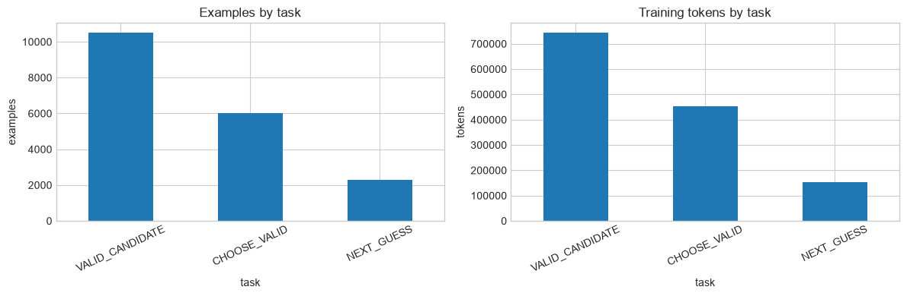
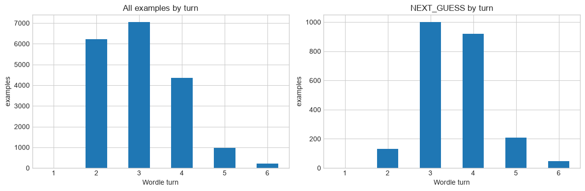
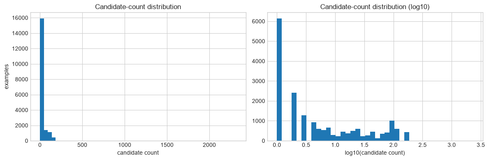
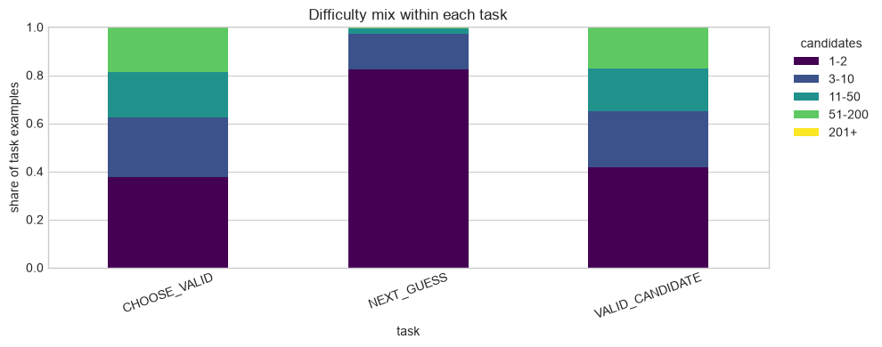
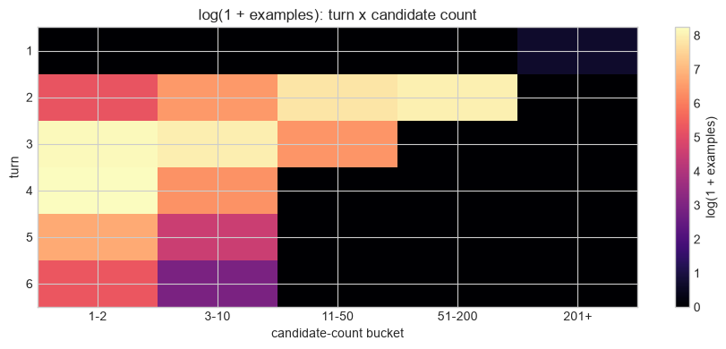

# Lab 13 - Exploratory Data Analysis of the Training Corpus

**Goal:** understand what the current Wordle corpus actually teaches before generating or training on any new data.

Part II uses a different workflow:

> **Observe -> Analyze -> Hypothesize -> Experiment -> Measure -> Iterate**

This notebook is intentionally model-free. It loads the persisted Lab 06 v2 corpus, measures its distributions, checks split integrity, and ends with concrete hypotheses for Lab 14.

## 13.1 Questions we need to answer

We will inspect:

- examples and tokens by task;
- `NEXT_GUESS` frequency and target concentration;
- turn, candidate-count, difficulty, and history-depth distributions;
- answer coverage;
- repeated model-facing examples and repeated underlying states;
- train/dev distribution differences;
- interactions between `turn x candidate_count` and `task x difficulty`.

The output of this lab is a set of testable data hypotheses, not a new model.

### Connect EDA to the Part I failures

EDA is not random archaeology. Each question below is motivated by behavior we already measured:

| Part I symptom | Dataset question |
| --- | --- |
| `NEXT_GUESS` exact match around 1.8% | How much direct policy training signal exists? |
| History consistency around 0-28% | How much deep-history policy supervision exists? |
| Repeated guesses | Is action or underlying-state diversity poor? |
| Solve rate around 0.5% | Are late-game policy states adequately represented? |


```python
from __future__ import annotations

from pathlib import Path
import json

import matplotlib.pyplot as plt
import numpy as np
import pandas as pd
from transformers import AutoTokenizer

pd.set_option("display.max_columns", 50)
pd.set_option("display.max_colwidth", 100)
plt.style.use("seaborn-v0_8-whitegrid")

DATA_DIR = Path("../data")
GENERATED_DIR = DATA_DIR / "generated"
MODEL_ID = "Qwen/Qwen3-0.6B"

FILES = {
    "train": GENERATED_DIR / "wordle-sft-train.jsonl",
    "dev": GENERATED_DIR / "wordle-sft-dev.jsonl",
    "test": GENERATED_DIR / "wordle-sft-test.jsonl",
}

for path in FILES.values():
    assert path.exists(), f"Run Lab 06 v2 first; missing {path}"

print("corpus files found")
```

    corpus files found


## 13.2 Load the persisted corpus

We analyze the saved JSONL files rather than regenerating examples. This keeps the object of study identical to the data consumed by Labs 07-12.


```python
frames = []

for file_split, path in FILES.items():
    split_df = pd.read_json(path, lines=True)
    assert split_df["split"].eq(file_split).all()
    frames.append(split_df)

df = pd.concat(frames, ignore_index=True)
manifest = json.loads(
    (GENERATED_DIR / "wordle-sft-manifest.json").read_text()
)

required_columns = {
    "task", "split", "answer", "turn", "candidate_count",
    "prompt", "response",
}
assert required_columns <= set(df.columns)
assert not df[list(required_columns)].isna().any().any()
assert len(df) == sum(manifest["counts"].values())

print("rows:", len(df))
print("columns:", list(df.columns))
display(df.head(3))
```

    rows: 18824
    columns: ['task', 'split', 'answer', 'turn', 'candidate_count', 'prompt', 'response']


<div>
<style scoped>
    .dataframe tbody tr th:only-of-type {
        vertical-align: middle;
    }

    .dataframe tbody tr th {
        vertical-align: top;
    }

    .dataframe thead th {
        text-align: right;
    }
</style>
<table border="1" class="dataframe">
  <thead>
    <tr style="text-align: right;">
      <th></th>
      <th>task</th>
      <th>split</th>
      <th>answer</th>
      <th>turn</th>
      <th>candidate_count</th>
      <th>prompt</th>
      <th>response</th>
    </tr>
  </thead>
  <tbody>
    <tr>
      <th>0</th>
      <td>VALID_CANDIDATE</td>
      <td>train</td>
      <td>ABACK</td>
      <td>2</td>
      <td>92</td>
      <td>Task: VALID_CANDIDATE\nYou are playing Wordle.\nGiven the game history, decide whether the candi...</td>
      <td>VALID</td>
    </tr>
    <tr>
      <th>1</th>
      <td>VALID_CANDIDATE</td>
      <td>train</td>
      <td>ABACK</td>
      <td>2</td>
      <td>92</td>
      <td>Task: VALID_CANDIDATE\nYou are playing Wordle.\nGiven the game history, decide whether the candi...</td>
      <td>INVALID</td>
    </tr>
    <tr>
      <th>2</th>
      <td>CHOOSE_VALID</td>
      <td>train</td>
      <td>ABACK</td>
      <td>2</td>
      <td>92</td>
      <td>Task: CHOOSE_VALID\nYou are playing Wordle.\nExactly one option is consistent with all previous ...</td>
      <td>BLANK</td>
    </tr>
  </tbody>
</table>
</div>


## 13.3 Derive analysis features

`candidate_count` is converted into stable, ordered difficulty buckets. History depth is parsed from the exact model-facing prompt rather than inferred from `turn`, so representation bugs remain visible.


```python
DIFFICULTY_LABELS = ["1-2", "3-10", "11-50", "51-200", "201+"]

def extract_history(prompt: str) -> str:
    marker = "History:\n"
    assert marker in prompt
    return prompt.split(marker, 1)[1].split("\n\n", 1)[0].strip()

def count_history_turns(prompt: str) -> int:
    history = extract_history(prompt)
    if history == "No previous guesses.":
        return 0
    return sum("->" in line for line in history.splitlines())

df["difficulty"] = pd.cut(
    df["candidate_count"],
    bins=[0, 2, 10, 50, 200, np.inf],
    labels=DIFFICULTY_LABELS,
    ordered=True,
)
df["history"] = df["prompt"].map(extract_history)
df["history_depth"] = df["prompt"].map(count_history_turns)
df["training_text"] = df["prompt"] + "\n" + df["response"]

history_mismatches = df.loc[df["history_depth"] != df["turn"] - 1]
assert history_mismatches.empty

display(df[[
    "task", "split", "turn", "history_depth",
    "candidate_count", "difficulty",
]].head())
```


<div>
<style scoped>
    .dataframe tbody tr th:only-of-type {
        vertical-align: middle;
    }

    .dataframe tbody tr th {
        vertical-align: top;
    }

    .dataframe thead th {
        text-align: right;
    }
</style>
<table border="1" class="dataframe">
  <thead>
    <tr style="text-align: right;">
      <th></th>
      <th>task</th>
      <th>split</th>
      <th>turn</th>
      <th>history_depth</th>
      <th>candidate_count</th>
      <th>difficulty</th>
    </tr>
  </thead>
  <tbody>
    <tr>
      <th>0</th>
      <td>VALID_CANDIDATE</td>
      <td>train</td>
      <td>2</td>
      <td>1</td>
      <td>92</td>
      <td>51-200</td>
    </tr>
    <tr>
      <th>1</th>
      <td>VALID_CANDIDATE</td>
      <td>train</td>
      <td>2</td>
      <td>1</td>
      <td>92</td>
      <td>51-200</td>
    </tr>
    <tr>
      <th>2</th>
      <td>CHOOSE_VALID</td>
      <td>train</td>
      <td>2</td>
      <td>1</td>
      <td>92</td>
      <td>51-200</td>
    </tr>
    <tr>
      <th>3</th>
      <td>VALID_CANDIDATE</td>
      <td>train</td>
      <td>3</td>
      <td>2</td>
      <td>6</td>
      <td>3-10</td>
    </tr>
    <tr>
      <th>4</th>
      <td>VALID_CANDIDATE</td>
      <td>train</td>
      <td>3</td>
      <td>2</td>
      <td>6</td>
      <td>3-10</td>
    </tr>
  </tbody>
</table>
</div>


## 13.4 Corpus overview

Start with counts, but do not mistake example balance for training-signal balance. Longer prompts consume more tokens and therefore more optimization compute.


```python
overview = pd.DataFrame({
    "examples": df.groupby("split").size(),
    "answers": df.groupby("split")["answer"].nunique(),
    "tasks": df.groupby("split")["task"].nunique(),
})
overview["example_share"] = overview["examples"] / len(df)
display(overview)

task_by_split = pd.crosstab(df["split"], df["task"])
display(task_by_split)
display(task_by_split.div(task_by_split.sum(axis=1), axis=0).round(3))
```


<div>
<style scoped>
    .dataframe tbody tr th:only-of-type {
        vertical-align: middle;
    }

    .dataframe tbody tr th {
        vertical-align: top;
    }

    .dataframe thead th {
        text-align: right;
    }
</style>
<table border="1" class="dataframe">
  <thead>
    <tr style="text-align: right;">
      <th></th>
      <th>examples</th>
      <th>answers</th>
      <th>tasks</th>
      <th>example_share</th>
    </tr>
    <tr>
      <th>split</th>
      <th></th>
      <th></th>
      <th></th>
      <th></th>
    </tr>
  </thead>
  <tbody>
    <tr>
      <th>dev</th>
      <td>2169</td>
      <td>231</td>
      <td>3</td>
      <td>0.115225</td>
    </tr>
    <tr>
      <th>test</th>
      <td>190</td>
      <td>19</td>
      <td>3</td>
      <td>0.010093</td>
    </tr>
    <tr>
      <th>train</th>
      <td>16465</td>
      <td>2064</td>
      <td>3</td>
      <td>0.874681</td>
    </tr>
  </tbody>
</table>
</div>


<div>
<style scoped>
    .dataframe tbody tr th:only-of-type {
        vertical-align: middle;
    }

    .dataframe tbody tr th {
        vertical-align: top;
    }

    .dataframe thead th {
        text-align: right;
    }
</style>
<table border="1" class="dataframe">
  <thead>
    <tr style="text-align: right;">
      <th>task</th>
      <th>CHOOSE_VALID</th>
      <th>NEXT_GUESS</th>
      <th>VALID_CANDIDATE</th>
    </tr>
    <tr>
      <th>split</th>
      <th></th>
      <th></th>
      <th></th>
    </tr>
  </thead>
  <tbody>
    <tr>
      <th>dev</th>
      <td>602</td>
      <td>385</td>
      <td>1182</td>
    </tr>
    <tr>
      <th>test</th>
      <td>49</td>
      <td>43</td>
      <td>98</td>
    </tr>
    <tr>
      <th>train</th>
      <td>5353</td>
      <td>1876</td>
      <td>9236</td>
    </tr>
  </tbody>
</table>
</div>


<div>
<style scoped>
    .dataframe tbody tr th:only-of-type {
        vertical-align: middle;
    }

    .dataframe tbody tr th {
        vertical-align: top;
    }

    .dataframe thead th {
        text-align: right;
    }
</style>
<table border="1" class="dataframe">
  <thead>
    <tr style="text-align: right;">
      <th>task</th>
      <th>CHOOSE_VALID</th>
      <th>NEXT_GUESS</th>
      <th>VALID_CANDIDATE</th>
    </tr>
    <tr>
      <th>split</th>
      <th></th>
      <th></th>
      <th></th>
    </tr>
  </thead>
  <tbody>
    <tr>
      <th>dev</th>
      <td>0.278</td>
      <td>0.178</td>
      <td>0.545</td>
    </tr>
    <tr>
      <th>test</th>
      <td>0.258</td>
      <td>0.226</td>
      <td>0.516</td>
    </tr>
    <tr>
      <th>train</th>
      <td>0.325</td>
      <td>0.114</td>
      <td>0.561</td>
    </tr>
  </tbody>
</table>
</div>


## 13.5 Examples versus training tokens

Token counts use the same tokenizer family as training. We include prompt and target text without padding; the comparison is about relative corpus composition, not packed-batch utilization.


```python
tokenizer = AutoTokenizer.from_pretrained(MODEL_ID)
encoded = tokenizer(
    df["training_text"].tolist(),
    add_special_tokens=True,
    truncation=False,
    padding=False,
)
df["token_count"] = [len(ids) for ids in encoded["input_ids"]]

task_signal = (
    df.groupby("task", observed=True)
    .agg(
        examples=("task", "size"),
        tokens=("token_count", "sum"),
        mean_tokens=("token_count", "mean"),
    )
    .sort_values("examples", ascending=False)
)
task_signal["example_share"] = task_signal["examples"] / task_signal["examples"].sum()
task_signal["token_share"] = task_signal["tokens"] / task_signal["tokens"].sum()
display(task_signal.round(3))

fig, axes = plt.subplots(1, 2, figsize=(12, 4))
task_signal["examples"].plot.bar(ax=axes[0], title="Examples by task")
task_signal["tokens"].plot.bar(ax=axes[1], title="Training tokens by task")
axes[0].set_ylabel("examples")
axes[1].set_ylabel("tokens")
for ax in axes:
    ax.tick_params(axis="x", rotation=25)
plt.tight_layout()
plt.show()
```


<div>
<style scoped>
    .dataframe tbody tr th:only-of-type {
        vertical-align: middle;
    }

    .dataframe tbody tr th {
        vertical-align: top;
    }

    .dataframe thead th {
        text-align: right;
    }
</style>
<table border="1" class="dataframe">
  <thead>
    <tr style="text-align: right;">
      <th></th>
      <th>examples</th>
      <th>tokens</th>
      <th>mean_tokens</th>
      <th>example_share</th>
      <th>token_share</th>
    </tr>
    <tr>
      <th>task</th>
      <th></th>
      <th></th>
      <th></th>
      <th></th>
      <th></th>
    </tr>
  </thead>
  <tbody>
    <tr>
      <th>VALID_CANDIDATE</th>
      <td>10516</td>
      <td>744476</td>
      <td>70.795</td>
      <td>0.559</td>
      <td>0.551</td>
    </tr>
    <tr>
      <th>CHOOSE_VALID</th>
      <td>6004</td>
      <td>452806</td>
      <td>75.417</td>
      <td>0.319</td>
      <td>0.335</td>
    </tr>
    <tr>
      <th>NEXT_GUESS</th>
      <td>2304</td>
      <td>152646</td>
      <td>66.253</td>
      <td>0.122</td>
      <td>0.113</td>
    </tr>
  </tbody>
</table>
</div>


    

    


## 13.6 How much policy data do we have?

`NEXT_GUESS` is the task closest to deployment gameplay. We measure its share by split and inspect whether a small number of teacher guesses dominate its targets.


```python
next_guess = df.loc[df["task"] == "NEXT_GUESS"].copy()

next_guess_share = (
    df.assign(is_next_guess=df["task"].eq("NEXT_GUESS"))
    .groupby("split")["is_next_guess"]
    .agg(["sum", "count", "mean"])
    .rename(columns={"sum": "next_guess", "count": "all_examples", "mean": "share"})
)
display(next_guess_share.round(3))

target_counts = next_guess["response"].value_counts()
target_summary = pd.Series({
    "examples": len(next_guess),
    "unique_targets": next_guess["response"].nunique(),
    "singleton_target_share": target_counts.eq(1).mean(),
    "top_10_example_share": target_counts.head(10).sum() / len(next_guess),
    "most_frequent_target_count": target_counts.max(),
}, name="NEXT_GUESS targets")
display(target_summary.to_frame())
display(target_counts.head(20).rename("examples").to_frame())
```


<div>
<style scoped>
    .dataframe tbody tr th:only-of-type {
        vertical-align: middle;
    }

    .dataframe tbody tr th {
        vertical-align: top;
    }

    .dataframe thead th {
        text-align: right;
    }
</style>
<table border="1" class="dataframe">
  <thead>
    <tr style="text-align: right;">
      <th></th>
      <th>next_guess</th>
      <th>all_examples</th>
      <th>share</th>
    </tr>
    <tr>
      <th>split</th>
      <th></th>
      <th></th>
      <th></th>
    </tr>
  </thead>
  <tbody>
    <tr>
      <th>dev</th>
      <td>385</td>
      <td>2169</td>
      <td>0.178</td>
    </tr>
    <tr>
      <th>test</th>
      <td>43</td>
      <td>190</td>
      <td>0.226</td>
    </tr>
    <tr>
      <th>train</th>
      <td>1876</td>
      <td>16465</td>
      <td>0.114</td>
    </tr>
  </tbody>
</table>
</div>


<div>
<style scoped>
    .dataframe tbody tr th:only-of-type {
        vertical-align: middle;
    }

    .dataframe tbody tr th {
        vertical-align: top;
    }

    .dataframe thead th {
        text-align: right;
    }
</style>
<table border="1" class="dataframe">
  <thead>
    <tr style="text-align: right;">
      <th></th>
      <th>NEXT_GUESS targets</th>
    </tr>
  </thead>
  <tbody>
    <tr>
      <th>examples</th>
      <td>2304.00000</td>
    </tr>
    <tr>
      <th>unique_targets</th>
      <td>2304.00000</td>
    </tr>
    <tr>
      <th>singleton_target_share</th>
      <td>1.00000</td>
    </tr>
    <tr>
      <th>top_10_example_share</th>
      <td>0.00434</td>
    </tr>
    <tr>
      <th>most_frequent_target_count</th>
      <td>1.00000</td>
    </tr>
  </tbody>
</table>
</div>


<div>
<style scoped>
    .dataframe tbody tr th:only-of-type {
        vertical-align: middle;
    }

    .dataframe tbody tr th {
        vertical-align: top;
    }

    .dataframe thead th {
        text-align: right;
    }
</style>
<table border="1" class="dataframe">
  <thead>
    <tr style="text-align: right;">
      <th></th>
      <th>examples</th>
    </tr>
    <tr>
      <th>response</th>
      <th></th>
    </tr>
  </thead>
  <tbody>
    <tr>
      <th>CEASE</th>
      <td>1</td>
    </tr>
    <tr>
      <th>ABASE</th>
      <td>1</td>
    </tr>
    <tr>
      <th>ABATE</th>
      <td>1</td>
    </tr>
    <tr>
      <th>BEADY</th>
      <td>1</td>
    </tr>
    <tr>
      <th>ABBEY</th>
      <td>1</td>
    </tr>
    <tr>
      <th>ABBOT</th>
      <td>1</td>
    </tr>
    <tr>
      <th>ARBOR</th>
      <td>1</td>
    </tr>
    <tr>
      <th>ABHOR</th>
      <td>1</td>
    </tr>
    <tr>
      <th>ALIKE</th>
      <td>1</td>
    </tr>
    <tr>
      <th>ABIDE</th>
      <td>1</td>
    </tr>
    <tr>
      <th>ABLED</th>
      <td>1</td>
    </tr>
    <tr>
      <th>ABODE</th>
      <td>1</td>
    </tr>
    <tr>
      <th>ABORT</th>
      <td>1</td>
    </tr>
    <tr>
      <th>ABOUT</th>
      <td>1</td>
    </tr>
    <tr>
      <th>ABOVE</th>
      <td>1</td>
    </tr>
    <tr>
      <th>ABUSE</th>
      <td>1</td>
    </tr>
    <tr>
      <th>ABYSS</th>
      <td>1</td>
    </tr>
    <tr>
      <th>ACORN</th>
      <td>1</td>
    </tr>
    <tr>
      <th>ACRID</th>
      <td>1</td>
    </tr>
    <tr>
      <th>ACTOR</th>
      <td>1</td>
    </tr>
  </tbody>
</table>
</div>


## 13.7 Turns and history depth

Late-game states matter because mistakes on turns 5-6 directly become failed games. Compare the overall corpus with the policy subset.


```python
turn_counts = pd.crosstab(df["turn"], df["task"]).sort_index()
display(turn_counts)

fig, axes = plt.subplots(1, 2, figsize=(12, 4), sharex=True)
df["turn"].value_counts().sort_index().plot.bar(ax=axes[0], title="All examples by turn")
next_guess["turn"].value_counts().sort_index().plot.bar(ax=axes[1], title="NEXT_GUESS by turn")
for ax in axes:
    ax.set_xlabel("Wordle turn")
    ax.set_ylabel("examples")
    ax.tick_params(axis="x", rotation=0)
plt.tight_layout()
plt.show()

history_by_task = pd.crosstab(df["history_depth"], df["task"])
display(history_by_task)
```


<div>
<style scoped>
    .dataframe tbody tr th:only-of-type {
        vertical-align: middle;
    }

    .dataframe tbody tr th {
        vertical-align: top;
    }

    .dataframe thead th {
        text-align: right;
    }
</style>
<table border="1" class="dataframe">
  <thead>
    <tr style="text-align: right;">
      <th>task</th>
      <th>CHOOSE_VALID</th>
      <th>NEXT_GUESS</th>
      <th>VALID_CANDIDATE</th>
    </tr>
    <tr>
      <th>turn</th>
      <th></th>
      <th></th>
      <th></th>
    </tr>
  </thead>
  <tbody>
    <tr>
      <th>1</th>
      <td>0</td>
      <td>1</td>
      <td>0</td>
    </tr>
    <tr>
      <th>2</th>
      <td>2314</td>
      <td>131</td>
      <td>3780</td>
    </tr>
    <tr>
      <th>3</th>
      <td>2183</td>
      <td>999</td>
      <td>3861</td>
    </tr>
    <tr>
      <th>4</th>
      <td>1184</td>
      <td>919</td>
      <td>2262</td>
    </tr>
    <tr>
      <th>5</th>
      <td>265</td>
      <td>207</td>
      <td>501</td>
    </tr>
    <tr>
      <th>6</th>
      <td>58</td>
      <td>47</td>
      <td>112</td>
    </tr>
  </tbody>
</table>
</div>


    

    


<div>
<style scoped>
    .dataframe tbody tr th:only-of-type {
        vertical-align: middle;
    }

    .dataframe tbody tr th {
        vertical-align: top;
    }

    .dataframe thead th {
        text-align: right;
    }
</style>
<table border="1" class="dataframe">
  <thead>
    <tr style="text-align: right;">
      <th>task</th>
      <th>CHOOSE_VALID</th>
      <th>NEXT_GUESS</th>
      <th>VALID_CANDIDATE</th>
    </tr>
    <tr>
      <th>history_depth</th>
      <th></th>
      <th></th>
      <th></th>
    </tr>
  </thead>
  <tbody>
    <tr>
      <th>0</th>
      <td>0</td>
      <td>1</td>
      <td>0</td>
    </tr>
    <tr>
      <th>1</th>
      <td>2314</td>
      <td>131</td>
      <td>3780</td>
    </tr>
    <tr>
      <th>2</th>
      <td>2183</td>
      <td>999</td>
      <td>3861</td>
    </tr>
    <tr>
      <th>3</th>
      <td>1184</td>
      <td>919</td>
      <td>2262</td>
    </tr>
    <tr>
      <th>4</th>
      <td>265</td>
      <td>207</td>
      <td>501</td>
    </tr>
    <tr>
      <th>5</th>
      <td>58</td>
      <td>47</td>
      <td>112</td>
    </tr>
  </tbody>
</table>
</div>


## 13.8 Candidate counts and difficulty

Candidate count is highly skewed, so use both a log-scale histogram and interpretable buckets. Small candidate sets are not necessarily easy for a language model: they often require precise late-game exploitation.


```python
display(
    df.groupby("task")["candidate_count"]
    .describe(percentiles=[0.25, 0.5, 0.75, 0.9, 0.99])
    .round(2)
)

fig, axes = plt.subplots(1, 2, figsize=(12, 4))
axes[0].hist(df["candidate_count"], bins=50)
axes[0].set_title("Candidate-count distribution")
axes[0].set_xlabel("candidate count")
axes[0].set_ylabel("examples")

axes[1].hist(np.log10(df["candidate_count"]), bins=40)
axes[1].set_title("Candidate-count distribution (log10)")
axes[1].set_xlabel("log10(candidate count)")
plt.tight_layout()
plt.show()

difficulty_by_task = pd.crosstab(df["task"], df["difficulty"], normalize="index")
display(difficulty_by_task.round(3))
difficulty_by_task.plot.bar(stacked=True, figsize=(10, 4), colormap="viridis")
plt.title("Difficulty mix within each task")
plt.ylabel("share of task examples")
plt.xticks(rotation=20)
plt.legend(title="candidates", bbox_to_anchor=(1.02, 1), loc="upper left")
plt.tight_layout()
plt.show()
```


<div>
<style scoped>
    .dataframe tbody tr th:only-of-type {
        vertical-align: middle;
    }

    .dataframe tbody tr th {
        vertical-align: top;
    }

    .dataframe thead th {
        text-align: right;
    }
</style>
<table border="1" class="dataframe">
  <thead>
    <tr style="text-align: right;">
      <th></th>
      <th>count</th>
      <th>mean</th>
      <th>std</th>
      <th>min</th>
      <th>25%</th>
      <th>50%</th>
      <th>75%</th>
      <th>90%</th>
      <th>99%</th>
      <th>max</th>
    </tr>
    <tr>
      <th>task</th>
      <th></th>
      <th></th>
      <th></th>
      <th></th>
      <th></th>
      <th></th>
      <th></th>
      <th></th>
      <th></th>
      <th></th>
    </tr>
  </thead>
  <tbody>
    <tr>
      <th>CHOOSE_VALID</th>
      <td>6004.0</td>
      <td>25.60</td>
      <td>40.78</td>
      <td>1.0</td>
      <td>1.0</td>
      <td>4.0</td>
      <td>26.0</td>
      <td>99.0</td>
      <td>168.0</td>
      <td>168.0</td>
    </tr>
    <tr>
      <th>NEXT_GUESS</th>
      <td>2304.0</td>
      <td>3.61</td>
      <td>48.79</td>
      <td>1.0</td>
      <td>1.0</td>
      <td>1.0</td>
      <td>2.0</td>
      <td>4.0</td>
      <td>26.0</td>
      <td>2315.0</td>
    </tr>
    <tr>
      <th>VALID_CANDIDATE</th>
      <td>10516.0</td>
      <td>23.66</td>
      <td>39.56</td>
      <td>1.0</td>
      <td>1.0</td>
      <td>4.0</td>
      <td>25.0</td>
      <td>92.0</td>
      <td>168.0</td>
      <td>168.0</td>
    </tr>
  </tbody>
</table>
</div>


    

    


<div>
<style scoped>
    .dataframe tbody tr th:only-of-type {
        vertical-align: middle;
    }

    .dataframe tbody tr th {
        vertical-align: top;
    }

    .dataframe thead th {
        text-align: right;
    }
</style>
<table border="1" class="dataframe">
  <thead>
    <tr style="text-align: right;">
      <th>difficulty</th>
      <th>1-2</th>
      <th>3-10</th>
      <th>11-50</th>
      <th>51-200</th>
      <th>201+</th>
    </tr>
    <tr>
      <th>task</th>
      <th></th>
      <th></th>
      <th></th>
      <th></th>
      <th></th>
    </tr>
  </thead>
  <tbody>
    <tr>
      <th>CHOOSE_VALID</th>
      <td>0.378</td>
      <td>0.244</td>
      <td>0.190</td>
      <td>0.187</td>
      <td>0.0</td>
    </tr>
    <tr>
      <th>NEXT_GUESS</th>
      <td>0.826</td>
      <td>0.145</td>
      <td>0.024</td>
      <td>0.005</td>
      <td>0.0</td>
    </tr>
    <tr>
      <th>VALID_CANDIDATE</th>
      <td>0.416</td>
      <td>0.235</td>
      <td>0.178</td>
      <td>0.171</td>
      <td>0.0</td>
    </tr>
  </tbody>
</table>
</div>


    

    


## 13.9 Cross important dimensions

Marginal distributions can hide holes. These tables reveal whether particular combinations of turn and difficulty receive little or no training signal.


```python
turn_difficulty = pd.crosstab(df["turn"], df["difficulty"])
display(turn_difficulty)

fig, ax = plt.subplots(figsize=(9, 4))
image = ax.imshow(np.log1p(turn_difficulty.values), aspect="auto", cmap="magma")
ax.set_xticks(range(len(turn_difficulty.columns)), turn_difficulty.columns)
ax.set_yticks(range(len(turn_difficulty.index)), turn_difficulty.index)
ax.set_xlabel("candidate-count bucket")
ax.set_ylabel("turn")
ax.set_title("log(1 + examples): turn x candidate count")
fig.colorbar(image, ax=ax, label="log(1 + examples)")
plt.tight_layout()
plt.show()

task_difficulty = pd.crosstab(df["task"], df["difficulty"])
display(task_difficulty)

policy_difficulty_by_split = pd.crosstab(
    next_guess["split"], next_guess["difficulty"]
)
display(policy_difficulty_by_split)

train_policy_coverage = pd.crosstab(
    next_guess.loc[next_guess["split"] == "train", "turn"],
    next_guess.loc[next_guess["split"] == "train", "difficulty"],
)
display(train_policy_coverage.style.set_caption(
    "Training NEXT_GUESS coverage: turn x candidate-count bucket"
))
```


<div>
<style scoped>
    .dataframe tbody tr th:only-of-type {
        vertical-align: middle;
    }

    .dataframe tbody tr th {
        vertical-align: top;
    }

    .dataframe thead th {
        text-align: right;
    }
</style>
<table border="1" class="dataframe">
  <thead>
    <tr style="text-align: right;">
      <th>difficulty</th>
      <th>1-2</th>
      <th>3-10</th>
      <th>11-50</th>
      <th>51-200</th>
      <th>201+</th>
    </tr>
    <tr>
      <th>turn</th>
      <th></th>
      <th></th>
      <th></th>
      <th></th>
      <th></th>
    </tr>
  </thead>
  <tbody>
    <tr>
      <th>1</th>
      <td>0</td>
      <td>0</td>
      <td>0</td>
      <td>0</td>
      <td>1</td>
    </tr>
    <tr>
      <th>2</th>
      <td>184</td>
      <td>661</td>
      <td>2445</td>
      <td>2935</td>
      <td>0</td>
    </tr>
    <tr>
      <th>3</th>
      <td>3491</td>
      <td>2928</td>
      <td>624</td>
      <td>0</td>
      <td>0</td>
    </tr>
    <tr>
      <th>4</th>
      <td>3792</td>
      <td>573</td>
      <td>0</td>
      <td>0</td>
      <td>0</td>
    </tr>
    <tr>
      <th>5</th>
      <td>883</td>
      <td>90</td>
      <td>0</td>
      <td>0</td>
      <td>0</td>
    </tr>
    <tr>
      <th>6</th>
      <td>199</td>
      <td>18</td>
      <td>0</td>
      <td>0</td>
      <td>0</td>
    </tr>
  </tbody>
</table>
</div>


    

    


<div>
<style scoped>
    .dataframe tbody tr th:only-of-type {
        vertical-align: middle;
    }

    .dataframe tbody tr th {
        vertical-align: top;
    }

    .dataframe thead th {
        text-align: right;
    }
</style>
<table border="1" class="dataframe">
  <thead>
    <tr style="text-align: right;">
      <th>difficulty</th>
      <th>1-2</th>
      <th>3-10</th>
      <th>11-50</th>
      <th>51-200</th>
      <th>201+</th>
    </tr>
    <tr>
      <th>task</th>
      <th></th>
      <th></th>
      <th></th>
      <th></th>
      <th></th>
    </tr>
  </thead>
  <tbody>
    <tr>
      <th>CHOOSE_VALID</th>
      <td>2271</td>
      <td>1467</td>
      <td>1143</td>
      <td>1123</td>
      <td>0</td>
    </tr>
    <tr>
      <th>NEXT_GUESS</th>
      <td>1902</td>
      <td>334</td>
      <td>55</td>
      <td>12</td>
      <td>1</td>
    </tr>
    <tr>
      <th>VALID_CANDIDATE</th>
      <td>4376</td>
      <td>2469</td>
      <td>1871</td>
      <td>1800</td>
      <td>0</td>
    </tr>
  </tbody>
</table>
</div>


<div>
<style scoped>
    .dataframe tbody tr th:only-of-type {
        vertical-align: middle;
    }

    .dataframe tbody tr th {
        vertical-align: top;
    }

    .dataframe thead th {
        text-align: right;
    }
</style>
<table border="1" class="dataframe">
  <thead>
    <tr style="text-align: right;">
      <th>difficulty</th>
      <th>1-2</th>
      <th>3-10</th>
      <th>11-50</th>
      <th>51-200</th>
      <th>201+</th>
    </tr>
    <tr>
      <th>split</th>
      <th></th>
      <th></th>
      <th></th>
      <th></th>
      <th></th>
    </tr>
  </thead>
  <tbody>
    <tr>
      <th>dev</th>
      <td>231</td>
      <td>113</td>
      <td>35</td>
      <td>6</td>
      <td>0</td>
    </tr>
    <tr>
      <th>test</th>
      <td>15</td>
      <td>13</td>
      <td>8</td>
      <td>6</td>
      <td>1</td>
    </tr>
    <tr>
      <th>train</th>
      <td>1656</td>
      <td>208</td>
      <td>12</td>
      <td>0</td>
      <td>0</td>
    </tr>
  </tbody>
</table>
</div>


<style type="text/css">
</style>
<table id="T_ea4d0">
  <caption>Training NEXT_GUESS coverage: turn x candidate-count bucket</caption>
  <thead>
    <tr>
      <th class="index_name level0" >difficulty</th>
      <th id="T_ea4d0_level0_col0" class="col_heading level0 col0" >1-2</th>
      <th id="T_ea4d0_level0_col1" class="col_heading level0 col1" >3-10</th>
      <th id="T_ea4d0_level0_col2" class="col_heading level0 col2" >11-50</th>
    </tr>
    <tr>
      <th class="index_name level0" >turn</th>
      <th class="blank col0" >&nbsp;</th>
      <th class="blank col1" >&nbsp;</th>
      <th class="blank col2" >&nbsp;</th>
    </tr>
  </thead>
  <tbody>
    <tr>
      <th id="T_ea4d0_level0_row0" class="row_heading level0 row0" >2</th>
      <td id="T_ea4d0_row0_col0" class="data row0 col0" >33</td>
      <td id="T_ea4d0_row0_col1" class="data row0 col1" >28</td>
      <td id="T_ea4d0_row0_col2" class="data row0 col2" >7</td>
    </tr>
    <tr>
      <th id="T_ea4d0_level0_row1" class="row_heading level0 row1" >3</th>
      <td id="T_ea4d0_row1_col0" class="data row1 col0" >649</td>
      <td id="T_ea4d0_row1_col1" class="data row1 col1" >140</td>
      <td id="T_ea4d0_row1_col2" class="data row1 col2" >5</td>
    </tr>
    <tr>
      <th id="T_ea4d0_level0_row2" class="row_heading level0 row2" >4</th>
      <td id="T_ea4d0_row2_col0" class="data row2 col0" >763</td>
      <td id="T_ea4d0_row2_col1" class="data row2 col1" >33</td>
      <td id="T_ea4d0_row2_col2" class="data row2 col2" >0</td>
    </tr>
    <tr>
      <th id="T_ea4d0_level0_row3" class="row_heading level0 row3" >5</th>
      <td id="T_ea4d0_row3_col0" class="data row3 col0" >174</td>
      <td id="T_ea4d0_row3_col1" class="data row3 col1" >5</td>
      <td id="T_ea4d0_row3_col2" class="data row3 col2" >0</td>
    </tr>
    <tr>
      <th id="T_ea4d0_level0_row4" class="row_heading level0 row4" >6</th>
      <td id="T_ea4d0_row4_col0" class="data row4 col0" >37</td>
      <td id="T_ea4d0_row4_col1" class="data row4 col1" >2</td>
      <td id="T_ea4d0_row4_col2" class="data row4 col2" >0</td>
    </tr>
  </tbody>
</table>


## 13.10 Answer coverage

The split is answer-level, so raw train/dev answer overlap must be zero. We also check which lexicon answers produce no examples and how many `NEXT_GUESS` decisions each answer contributes.


```python
answers = {
    line.strip().upper()
    for line in (DATA_DIR / "wordle-answers-original.txt").read_text().splitlines()
    if line.strip()
}
answers_by_split = {
    split: set(group["answer"])
    for split, group in df.groupby("split")
}

assert answers_by_split["train"].isdisjoint(answers_by_split["dev"])
assert answers_by_split["train"].isdisjoint(answers_by_split["test"])
assert answers_by_split["dev"].isdisjoint(answers_by_split["test"])

covered_answers = set(df["answer"])
coverage = pd.Series({
    "lexicon_answers": len(answers),
    "covered_answers": len(covered_answers),
    "missing_answers": len(answers - covered_answers),
    "coverage_rate": len(covered_answers) / len(answers),
})
display(coverage.to_frame("value"))
print("missing answers:", sorted(answers - covered_answers))

policy_examples_per_answer = next_guess.groupby("answer").size()
display(policy_examples_per_answer.describe().to_frame("NEXT_GUESS examples per answer"))
```


<div>
<style scoped>
    .dataframe tbody tr th:only-of-type {
        vertical-align: middle;
    }

    .dataframe tbody tr th {
        vertical-align: top;
    }

    .dataframe thead th {
        text-align: right;
    }
</style>
<table border="1" class="dataframe">
  <thead>
    <tr style="text-align: right;">
      <th></th>
      <th>value</th>
    </tr>
  </thead>
  <tbody>
    <tr>
      <th>lexicon_answers</th>
      <td>2315.000000</td>
    </tr>
    <tr>
      <th>covered_answers</th>
      <td>2314.000000</td>
    </tr>
    <tr>
      <th>missing_answers</th>
      <td>1.000000</td>
    </tr>
    <tr>
      <th>coverage_rate</th>
      <td>0.999568</td>
    </tr>
  </tbody>
</table>
</div>


    missing answers: ['RAISE']


<div>
<style scoped>
    .dataframe tbody tr th:only-of-type {
        vertical-align: middle;
    }

    .dataframe tbody tr th {
        vertical-align: top;
    }

    .dataframe thead th {
        text-align: right;
    }
</style>
<table border="1" class="dataframe">
  <thead>
    <tr style="text-align: right;">
      <th></th>
      <th>NEXT_GUESS examples per answer</th>
    </tr>
  </thead>
  <tbody>
    <tr>
      <th>count</th>
      <td>2051.000000</td>
    </tr>
    <tr>
      <th>mean</th>
      <td>1.123354</td>
    </tr>
    <tr>
      <th>std</th>
      <td>0.420099</td>
    </tr>
    <tr>
      <th>min</th>
      <td>1.000000</td>
    </tr>
    <tr>
      <th>25%</th>
      <td>1.000000</td>
    </tr>
    <tr>
      <th>50%</th>
      <td>1.000000</td>
    </tr>
    <tr>
      <th>75%</th>
      <td>1.000000</td>
    </tr>
    <tr>
      <th>max</th>
      <td>5.000000</td>
    </tr>
  </tbody>
</table>
</div>


## 13.11 Repeated examples and repeated states

There are three different duplication questions:

1. exact `(prompt, response)` duplicates repeat identical supervision;
2. prompts with multiple targets indicate ambiguity;
3. the same Wordle history reused across auxiliary tasks can cause a few states to dominate the corpus even when exact prompts are unique.

State reuse is not automatically bad, but it should be an intentional curriculum choice.


```python
exact_duplicate_rows = df.duplicated(["prompt", "response"], keep=False)
prompt_target_counts = df.groupby("prompt")["response"].nunique()
state_reuse = df.groupby(["split", "history"]).agg(
    examples=("task", "size"),
    tasks=("task", "nunique"),
    answers=("answer", "nunique"),
).sort_values("examples", ascending=False)

duplication_summary = pd.Series({
    "rows_in_exact_duplicate_groups": int(exact_duplicate_rows.sum()),
    "ambiguous_prompts": int(prompt_target_counts.gt(1).sum()),
    "unique_histories": df["history"].nunique(),
    "histories_reused_within_split": int(state_reuse["examples"].gt(1).sum()),
    "max_examples_from_one_history": int(state_reuse["examples"].max()),
})
display(duplication_summary.to_frame("value"))
display(state_reuse.head(15))

effective_state_reuse = df.groupby("task").agg(
    examples=("task", "size"),
    unique_histories=("history", "nunique"),
)
effective_state_reuse["examples_per_unique_history"] = (
    effective_state_reuse["examples"]
    / effective_state_reuse["unique_histories"]
)
display(effective_state_reuse.sort_values(
    "examples_per_unique_history", ascending=False
).round(3))
```


<div>
<style scoped>
    .dataframe tbody tr th:only-of-type {
        vertical-align: middle;
    }

    .dataframe tbody tr th {
        vertical-align: top;
    }

    .dataframe thead th {
        text-align: right;
    }
</style>
<table border="1" class="dataframe">
  <thead>
    <tr style="text-align: right;">
      <th></th>
      <th>value</th>
    </tr>
  </thead>
  <tbody>
    <tr>
      <th>rows_in_exact_duplicate_groups</th>
      <td>0</td>
    </tr>
    <tr>
      <th>ambiguous_prompts</th>
      <td>0</td>
    </tr>
    <tr>
      <th>unique_histories</th>
      <td>2304</td>
    </tr>
    <tr>
      <th>histories_reused_within_split</th>
      <td>2587</td>
    </tr>
    <tr>
      <th>max_examples_from_one_history</th>
      <td>362</td>
    </tr>
  </tbody>
</table>
</div>


<div>
<style scoped>
    .dataframe tbody tr th:only-of-type {
        vertical-align: middle;
    }

    .dataframe tbody tr th {
        vertical-align: top;
    }

    .dataframe thead th {
        text-align: right;
    }
</style>
<table border="1" class="dataframe">
  <thead>
    <tr style="text-align: right;">
      <th></th>
      <th></th>
      <th>examples</th>
      <th>tasks</th>
      <th>answers</th>
    </tr>
    <tr>
      <th>split</th>
      <th>history</th>
      <th></th>
      <th></th>
      <th></th>
    </tr>
  </thead>
  <tbody>
    <tr>
      <th rowspan="15" valign="top">train</th>
      <th>R A I S E -&gt; B B B B B</th>
      <td>362</td>
      <td>2</td>
      <td>142</td>
    </tr>
    <tr>
      <th>R A I S E -&gt; B B B B Y</th>
      <td>272</td>
      <td>2</td>
      <td>107</td>
    </tr>
    <tr>
      <th>R A I S E -&gt; B B Y B B</th>
      <td>254</td>
      <td>2</td>
      <td>99</td>
    </tr>
    <tr>
      <th>R A I S E -&gt; Y B B B Y</th>
      <td>240</td>
      <td>2</td>
      <td>93</td>
    </tr>
    <tr>
      <th>R A I S E -&gt; Y B B B B</th>
      <td>228</td>
      <td>2</td>
      <td>90</td>
    </tr>
    <tr>
      <th>R A I S E -&gt; B Y B B B</th>
      <td>221</td>
      <td>2</td>
      <td>85</td>
    </tr>
    <tr>
      <th>R A I S E -&gt; B G B B B</th>
      <td>221</td>
      <td>2</td>
      <td>87</td>
    </tr>
    <tr>
      <th>R A I S E -&gt; B B B Y B</th>
      <td>196</td>
      <td>2</td>
      <td>75</td>
    </tr>
    <tr>
      <th>R A I S E -&gt; Y Y B B B</th>
      <td>179</td>
      <td>2</td>
      <td>70</td>
    </tr>
    <tr>
      <th>R A I S E -&gt; B Y B B Y</th>
      <td>154</td>
      <td>2</td>
      <td>60</td>
    </tr>
    <tr>
      <th>R A I S E -&gt; B B B B G</th>
      <td>133</td>
      <td>2</td>
      <td>52</td>
    </tr>
    <tr>
      <th>R A I S E -&gt; B Y B Y B</th>
      <td>109</td>
      <td>2</td>
      <td>40</td>
    </tr>
    <tr>
      <th>R A I S E -&gt; B B G B B</th>
      <td>101</td>
      <td>2</td>
      <td>40</td>
    </tr>
    <tr>
      <th>R A I S E -&gt; B B B Y Y</th>
      <td>96</td>
      <td>2</td>
      <td>37</td>
    </tr>
    <tr>
      <th>R A I S E -&gt; Y B B B G</th>
      <td>94</td>
      <td>2</td>
      <td>36</td>
    </tr>
  </tbody>
</table>
</div>


<div>
<style scoped>
    .dataframe tbody tr th:only-of-type {
        vertical-align: middle;
    }

    .dataframe tbody tr th {
        vertical-align: top;
    }

    .dataframe thead th {
        text-align: right;
    }
</style>
<table border="1" class="dataframe">
  <thead>
    <tr style="text-align: right;">
      <th></th>
      <th>examples</th>
      <th>unique_histories</th>
      <th>examples_per_unique_history</th>
    </tr>
    <tr>
      <th>task</th>
      <th></th>
      <th></th>
      <th></th>
    </tr>
  </thead>
  <tbody>
    <tr>
      <th>VALID_CANDIDATE</th>
      <td>10516</td>
      <td>2303</td>
      <td>4.566</td>
    </tr>
    <tr>
      <th>CHOOSE_VALID</th>
      <td>6004</td>
      <td>2303</td>
      <td>2.607</td>
    </tr>
    <tr>
      <th>NEXT_GUESS</th>
      <td>2304</td>
      <td>2304</td>
      <td>1.000</td>
    </tr>
  </tbody>
</table>
</div>


## 13.12 Train versus dev distributions

A held-out split should differ in answers, not accidentally in task or difficulty mix. Total variation distance summarizes categorical drift: `0` means identical proportions and `1` means no overlap.


```python
def normalized_distribution(data: pd.DataFrame, column: str) -> pd.Series:
    return data[column].value_counts(normalize=True, sort=False)

def compare_splits(column: str) -> tuple[pd.DataFrame, float]:
    comparison = pd.concat(
        {
            split: normalized_distribution(
                df.loc[df["split"] == split], column
            )
            for split in ["train", "dev"]
        },
        axis=1,
    ).fillna(0)
    comparison["absolute_gap"] = (comparison["train"] - comparison["dev"]).abs()
    total_variation = 0.5 * comparison["absolute_gap"].sum()
    return comparison, float(total_variation)

drift_rows = []
for column in ["task", "turn", "difficulty", "history_depth"]:
    comparison, total_variation = compare_splits(column)
    drift_rows.append({"dimension": column, "total_variation": total_variation})
    print(f"\n{column} (TV={total_variation:.4f})")
    display(comparison.round(4))

drift_df = pd.DataFrame(drift_rows).sort_values("total_variation", ascending=False)
display(drift_df)
```

    
    task (TV=0.0636)


<div>
<style scoped>
    .dataframe tbody tr th:only-of-type {
        vertical-align: middle;
    }

    .dataframe tbody tr th {
        vertical-align: top;
    }

    .dataframe thead th {
        text-align: right;
    }
</style>
<table border="1" class="dataframe">
  <thead>
    <tr style="text-align: right;">
      <th></th>
      <th>train</th>
      <th>dev</th>
      <th>absolute_gap</th>
    </tr>
    <tr>
      <th>task</th>
      <th></th>
      <th></th>
      <th></th>
    </tr>
  </thead>
  <tbody>
    <tr>
      <th>VALID_CANDIDATE</th>
      <td>0.5609</td>
      <td>0.5450</td>
      <td>0.0160</td>
    </tr>
    <tr>
      <th>CHOOSE_VALID</th>
      <td>0.3251</td>
      <td>0.2775</td>
      <td>0.0476</td>
    </tr>
    <tr>
      <th>NEXT_GUESS</th>
      <td>0.1139</td>
      <td>0.1775</td>
      <td>0.0636</td>
    </tr>
  </tbody>
</table>
</div>


    
    turn (TV=0.0206)


<div>
<style scoped>
    .dataframe tbody tr th:only-of-type {
        vertical-align: middle;
    }

    .dataframe tbody tr th {
        vertical-align: top;
    }

    .dataframe thead th {
        text-align: right;
    }
</style>
<table border="1" class="dataframe">
  <thead>
    <tr style="text-align: right;">
      <th></th>
      <th>train</th>
      <th>dev</th>
      <th>absolute_gap</th>
    </tr>
    <tr>
      <th>turn</th>
      <th></th>
      <th></th>
      <th></th>
    </tr>
  </thead>
  <tbody>
    <tr>
      <th>2</th>
      <td>0.3295</td>
      <td>0.3347</td>
      <td>0.0052</td>
    </tr>
    <tr>
      <th>3</th>
      <td>0.3727</td>
      <td>0.3850</td>
      <td>0.0122</td>
    </tr>
    <tr>
      <th>4</th>
      <td>0.2345</td>
      <td>0.2144</td>
      <td>0.0201</td>
    </tr>
    <tr>
      <th>5</th>
      <td>0.0521</td>
      <td>0.0516</td>
      <td>0.0005</td>
    </tr>
    <tr>
      <th>6</th>
      <td>0.0111</td>
      <td>0.0143</td>
      <td>0.0032</td>
    </tr>
  </tbody>
</table>
</div>


    
    difficulty (TV=0.0197)


<div>
<style scoped>
    .dataframe tbody tr th:only-of-type {
        vertical-align: middle;
    }

    .dataframe tbody tr th {
        vertical-align: top;
    }

    .dataframe thead th {
        text-align: right;
    }
</style>
<table border="1" class="dataframe">
  <thead>
    <tr style="text-align: right;">
      <th></th>
      <th>train</th>
      <th>dev</th>
      <th>absolute_gap</th>
    </tr>
    <tr>
      <th>difficulty</th>
      <th></th>
      <th></th>
      <th></th>
    </tr>
  </thead>
  <tbody>
    <tr>
      <th>1-2</th>
      <td>0.4577</td>
      <td>0.4380</td>
      <td>0.0197</td>
    </tr>
    <tr>
      <th>3-10</th>
      <td>0.2242</td>
      <td>0.2370</td>
      <td>0.0127</td>
    </tr>
    <tr>
      <th>11-50</th>
      <td>0.1625</td>
      <td>0.1664</td>
      <td>0.0039</td>
    </tr>
    <tr>
      <th>51-200</th>
      <td>0.1555</td>
      <td>0.1586</td>
      <td>0.0031</td>
    </tr>
    <tr>
      <th>201+</th>
      <td>0.0000</td>
      <td>0.0000</td>
      <td>0.0000</td>
    </tr>
  </tbody>
</table>
</div>


    
    history_depth (TV=0.0206)


<div>
<style scoped>
    .dataframe tbody tr th:only-of-type {
        vertical-align: middle;
    }

    .dataframe tbody tr th {
        vertical-align: top;
    }

    .dataframe thead th {
        text-align: right;
    }
</style>
<table border="1" class="dataframe">
  <thead>
    <tr style="text-align: right;">
      <th></th>
      <th>train</th>
      <th>dev</th>
      <th>absolute_gap</th>
    </tr>
    <tr>
      <th>history_depth</th>
      <th></th>
      <th></th>
      <th></th>
    </tr>
  </thead>
  <tbody>
    <tr>
      <th>1</th>
      <td>0.3295</td>
      <td>0.3347</td>
      <td>0.0052</td>
    </tr>
    <tr>
      <th>2</th>
      <td>0.3727</td>
      <td>0.3850</td>
      <td>0.0122</td>
    </tr>
    <tr>
      <th>3</th>
      <td>0.2345</td>
      <td>0.2144</td>
      <td>0.0201</td>
    </tr>
    <tr>
      <th>4</th>
      <td>0.0521</td>
      <td>0.0516</td>
      <td>0.0005</td>
    </tr>
    <tr>
      <th>5</th>
      <td>0.0111</td>
      <td>0.0143</td>
      <td>0.0032</td>
    </tr>
  </tbody>
</table>
</div>


<div>
<style scoped>
    .dataframe tbody tr th:only-of-type {
        vertical-align: middle;
    }

    .dataframe tbody tr th {
        vertical-align: top;
    }

    .dataframe thead th {
        text-align: right;
    }
</style>
<table border="1" class="dataframe">
  <thead>
    <tr style="text-align: right;">
      <th></th>
      <th>dimension</th>
      <th>total_variation</th>
    </tr>
  </thead>
  <tbody>
    <tr>
      <th>0</th>
      <td>task</td>
      <td>0.063562</td>
    </tr>
    <tr>
      <th>1</th>
      <td>turn</td>
      <td>0.020587</td>
    </tr>
    <tr>
      <th>3</th>
      <td>history_depth</td>
      <td>0.020587</td>
    </tr>
    <tr>
      <th>2</th>
      <td>difficulty</td>
      <td>0.019708</td>
    </tr>
  </tbody>
</table>
</div>


## 13.13 Compact diagnostic scorecard

This scorecard turns the plots into values that can guide Lab 14. It deliberately reports observations without prescribing arbitrary target percentages.


```python
train = df.loc[df["split"] == "train"]
train_policy = train.loc[train["task"] == "NEXT_GUESS"]
train_target_counts = train_policy["response"].value_counts()

scorecard = pd.Series({
    "train examples": len(train),
    "train tokens": int(train["token_count"].sum()),
    "NEXT_GUESS example share": train["task"].eq("NEXT_GUESS").mean(),
    "NEXT_GUESS token share": (
        train.loc[train["task"] == "NEXT_GUESS", "token_count"].sum()
        / train["token_count"].sum()
    ),
    "late-game (turn 5-6) example share": train["turn"].ge(5).mean(),
    "late-game NEXT_GUESS share": train_policy["turn"].ge(5).mean(),
    "multi-turn (history >= 3) share": train["history_depth"].ge(3).mean(),
    "NEXT_GUESS history >= 3 share": train_policy["history_depth"].ge(3).mean(),
    "small-set (<= 10) share": train["candidate_count"].le(10).mean(),
    "unique NEXT_GUESS target rate": (
        train_policy["response"].nunique() / len(train_policy)
    ),
    "top-10 NEXT_GUESS target share": (
        train_target_counts.head(10).sum() / len(train_policy)
    ),
    "answer coverage": len(covered_answers) / len(answers),
})
display(scorecard.to_frame("value").style.format("{:.3f}"))
```


<style type="text/css">
</style>
<table id="T_e19d5">
  <thead>
    <tr>
      <th class="blank level0" >&nbsp;</th>
      <th id="T_e19d5_level0_col0" class="col_heading level0 col0" >value</th>
    </tr>
  </thead>
  <tbody>
    <tr>
      <th id="T_e19d5_level0_row0" class="row_heading level0 row0" >train examples</th>
      <td id="T_e19d5_row0_col0" class="data row0 col0" >16465.000</td>
    </tr>
    <tr>
      <th id="T_e19d5_level0_row1" class="row_heading level0 row1" >train tokens</th>
      <td id="T_e19d5_row1_col0" class="data row1 col0" >1183628.000</td>
    </tr>
    <tr>
      <th id="T_e19d5_level0_row2" class="row_heading level0 row2" >NEXT_GUESS example share</th>
      <td id="T_e19d5_row2_col0" class="data row2 col0" >0.114</td>
    </tr>
    <tr>
      <th id="T_e19d5_level0_row3" class="row_heading level0 row3" >NEXT_GUESS token share</th>
      <td id="T_e19d5_row3_col0" class="data row3 col0" >0.106</td>
    </tr>
    <tr>
      <th id="T_e19d5_level0_row4" class="row_heading level0 row4" >late-game (turn 5-6) example share</th>
      <td id="T_e19d5_row4_col0" class="data row4 col0" >0.063</td>
    </tr>
    <tr>
      <th id="T_e19d5_level0_row5" class="row_heading level0 row5" >late-game NEXT_GUESS share</th>
      <td id="T_e19d5_row5_col0" class="data row5 col0" >0.116</td>
    </tr>
    <tr>
      <th id="T_e19d5_level0_row6" class="row_heading level0 row6" >multi-turn (history >= 3) share</th>
      <td id="T_e19d5_row6_col0" class="data row6 col0" >0.298</td>
    </tr>
    <tr>
      <th id="T_e19d5_level0_row7" class="row_heading level0 row7" >NEXT_GUESS history >= 3 share</th>
      <td id="T_e19d5_row7_col0" class="data row7 col0" >0.541</td>
    </tr>
    <tr>
      <th id="T_e19d5_level0_row8" class="row_heading level0 row8" >small-set (<= 10) share</th>
      <td id="T_e19d5_row8_col0" class="data row8 col0" >0.682</td>
    </tr>
    <tr>
      <th id="T_e19d5_level0_row9" class="row_heading level0 row9" >unique NEXT_GUESS target rate</th>
      <td id="T_e19d5_row9_col0" class="data row9 col0" >1.000</td>
    </tr>
    <tr>
      <th id="T_e19d5_level0_row10" class="row_heading level0 row10" >top-10 NEXT_GUESS target share</th>
      <td id="T_e19d5_row10_col0" class="data row10 col0" >0.005</td>
    </tr>
    <tr>
      <th id="T_e19d5_level0_row11" class="row_heading level0 row11" >answer coverage</th>
      <td id="T_e19d5_row11_col0" class="data row11 col0" >1.000</td>
    </tr>
  </tbody>
</table>


## 13.14 Write evidence-based hypotheses

Complete these statements using the scorecard and plots above. Each hypothesis must name an observation, an expected behavioral consequence, and a measurable intervention.

### Hypothesis 1 - Policy-task allocation

**Observation:** `NEXT_GUESS` accounts for ___ of train examples and ___ of train tokens.

**Expected consequence:** ___

**Lab 14 intervention:** ___

### Hypothesis 2 - Late-game and long-history coverage

**Observation:** Turns 5-6 account for ___ of policy examples; histories of depth 3+ account for ___ of all examples.

**Expected consequence:** ___

**Lab 14 intervention:** ___

### Hypothesis 3 - Candidate-count balance

**Observation:** ___

**Expected consequence:** ___

**Lab 14 intervention:** ___

### Hypothesis 4 - State reuse and diversity

**Observation:** ___

**Expected consequence:** ___

**Lab 14 intervention:** ___

### Hypothesis 5 - Split comparability

**Observation:** the largest train/dev total variation distance is ___ on dimension ___.

**Expected consequence:** ___

**Lab 14 intervention:** ___

# Lab 13 checkpoint

Before moving to Lab 14, record:

1. the task and token distribution table;
2. `NEXT_GUESS` example/token shares;
3. late-game and long-history shares;
4. the weakest `turn x candidate_count` regions;
5. answer coverage and state-reuse results;
6. train/dev total variation distances;
7. at least three hypotheses in the observation -> consequence -> intervention format.

Lab 14 will use those observations to define Dataset B while preserving Dataset A as the control.
